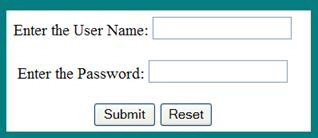
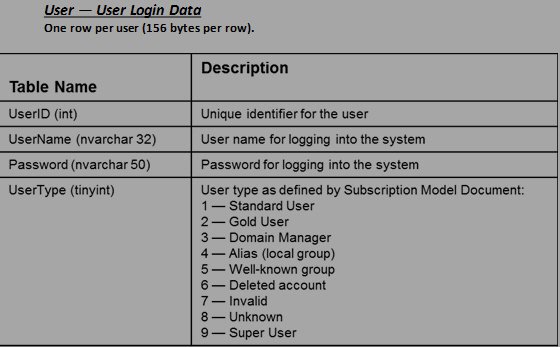

Different clients will have different levels of documentation on what they want to be built. You need to be ready to do a spec review for any one of the following 5 possible cases:

<!--endintro-->

#### Types of specifications

### 1. I have an idea...

Run from this
or
verify they have a really hefty bank account!

### 2. High-Level Requirements Document

::: greybox
This will read like a wish list with no details and many unanswered questions  
:::
 **Figure: High-Level Requirements are very vague and open to many interpretations** 
### 3. Detailed Requirements Document

The details have been fleshed out and allow developers to write Functional and Technical Specifications
* We need a login page for www.northwind.com
* Must match existing site look and feel
* Username is already in the Users table in the ABC database (SQL Server 2008)
* Password should be at least 8 characters
* .NET 4 is already used for the existing site so that is what this should use of course
* Should look like this:

 **Figure: Detailed Requirements have more of the details you want** 
### 4. Functional Specification
This will include detailed mock-ups for the UI, use cases/user stories and might be at a level to allow for fixed price quoting on the project
* We need a login page for [www.northwind.com](http://www.northwind.com/)
* Must match existing site look and feel
* Users table must be defined and added to the ABC database (SQL Server 2008)
* **User Name consists of user first initial and first 7 characters of the last name** 
-  **For example Joe Jones -&gt; jjones**
* Password should be at least 8 characters
* Site uses .NET 4 and this interface must be added to existing project
* This is the layout for the login interface
* **A red asterisk (\*) should be displayed if a value is left blank and Submit is pressed** 

 **Figure: Functional Specifications go into more detail about the user interface and interactions in the system** 
### 5. Technical Specification

This is the blueprint for the application. There should be no unanswered questions and should allow for a fixed price quote.

* We need a login page for www.northwind.com
* Must match existing site look and feel
* Users table must be defined and added to the ABC database (SQL Server 2008)
* User Name consists of user first initial and first 7 characters of the last name
* For example Joe Jones -&gt; jjones
* Password should be at least 8 characters
* Site uses .NET 4 and this interface must be added to existing project
* Define the data model explicitly

* Must work with IE7, IE8, IE9, and FF3
* Must display correctly at 1024x768 resolution
* Must support ANSI characters for Username and Password
* Will not support mobile browsers
* Will not be tested with localization (assumes en-us local on US versions of software)
* SQL Membership provider will be leveraged

 **Figure: Technical Specifications will become the blueprint of the application. There shouldn’t be any unknowns**
