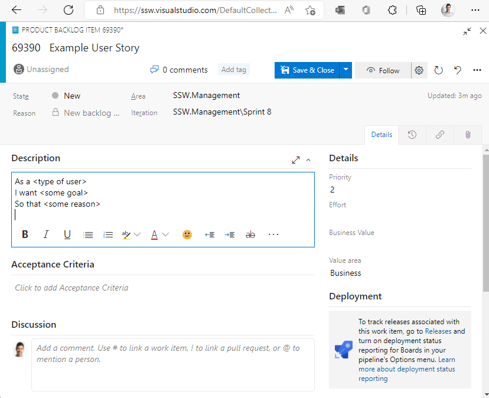

Product Backlog Items (PBIs) can be described in the form of a "User Stories" when appropriate. It ensures the developers will know the context for a PBI.

::: greybox
As a **\[type of User]**\
I want  **\[some goal]**\
So that **\[some reason]** 
:::
**Figure: User Story - template for description**

<!--endintro-->

::: greybox
I want to be able to search for customers.
:::
::: bad
Figure: Bad Example - the user story is too vague and broad in scope
:::

::: greybox
As a **Marketing Manager**,  
I want to **be able to search for customers by country and last name**,  
So that **I can find their numbers and call customers that are close to me**.  
:::
::: good
Figure: Good Example - Clear user story following the [INVEST principle](https://en.wikipedia.org/wiki/INVEST_(mnemonic))
:::