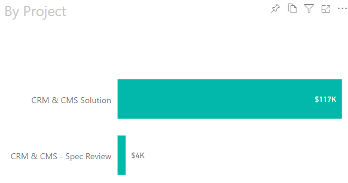

When entering timesheets against a client for a Spec Review, you should always create a separate project so that this time does not pollute the data for the total project costs.

<!--endintro-->

When a client asks how you are tracking against an estimate, this is always the post-Spec Review estimate and so should be compared to the post Spec Review costs.

The naming convention should be "{{ PROJECT NAME }} - Spec Review".

::: good

:::
