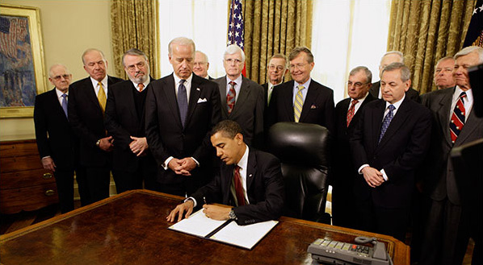
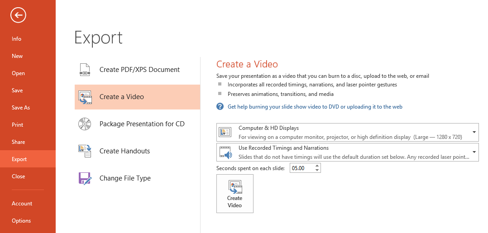

The findings of the Spec Review should be presented by the developers and the Account Manager at a meeting with the key decision makers of the project for review and acceptance. It is important that all the required people are in a room together to review the plan. It is also valuable to [record this meeting](/record-teams-meetings).

<!--endintro-->

  

If you've run the Spec Review successfully the client should not be surprised by anything you present. This means discussions should focus on issues such as what particular requirements could be added into the scope for the MVP, or what releases can be completed by what date, rather than spending the meeting helping the client regain consciousness after they blacked out from seeing the price.

The Spec Review presentation should be scheduled by the Consultant or Account Manager for the afternoon of the final day of the Spec Review.

::: greybox
“I will send you a proposal when I get back to the office.”  
:::
::: bad
Figure: Bad example – a common mistake is to tell the client you will complete it later     
:::

::: greybox
“Let’s schedule a meeting now for Wed 3 pm. I will send a meeting invite to all the stakeholders.”  
:::
::: good
Figure: Good example – this is an appointment with a specific time for the next schedule The benefits are:  
:::

* You are striking while the iron is hot
* All parties benefit while the information is fresh in their minds
* The client won't experience the inevitable delays when you go back to the office and get stuck on other client issues that appear more urgent

### What does the client get at the conclusion of the Spec Review? 
   
* **Option A** - Email (if they want to minimize documentation time)

* **Option B** - Word document (if they need to get approval from someone higher up)

* **Option C** - PowerPoint presentation (if they are the decision maker, and they don't want a doc)

::: good  
  
:::

* **Option D** - Video of PowerPoint presentation with narrations **exported to a video** (the best option to gather more feedback, you can even gather public feedback E.g. PointBank https://sswconsulting.github.io/PointBank/)

::: greybox
**Note:** Make sure to name your video according to [including version numbers in your file](/post-production-do-you-use-a-version-number-on-your-videos). Publish your video to YouTube afterwards so you can easily share it with colleagues and clients.
:::
  
#### Video Examples 

`youtube: https://www.youtube.com/embed/nywSzMhkZV4`

::: good
Figure: Good example – FireBootCamp - SugarLearning Specification Video      
:::

`youtube: https://www.youtube.com/embed/VhWPZERUiYg`

::: good
Figure: Good example – FireBootCamp - TimePro Invoicing Specification Video  
:::

Once again, the presentation needs to pass a '[Test Please](/conduct-a-test-please-internally-and-then-with-the-client)' from another senior employee before the meeting takes place.
