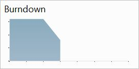
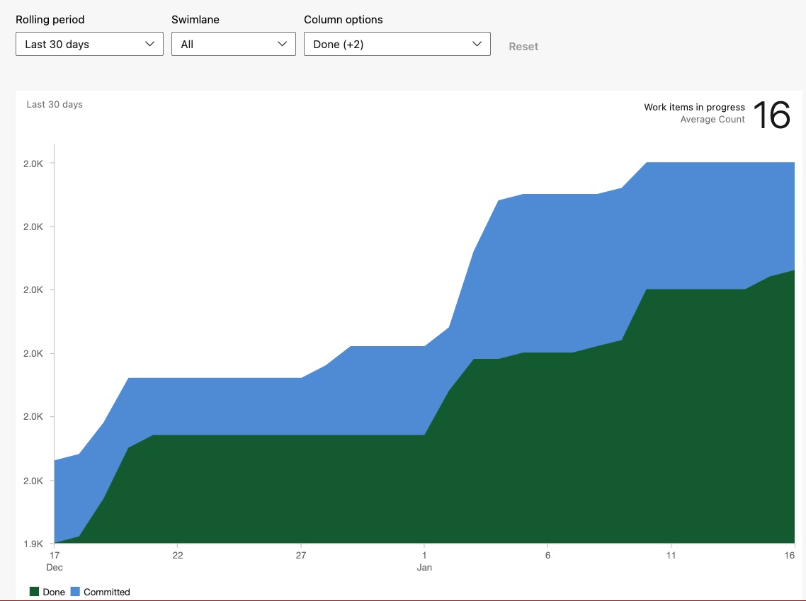
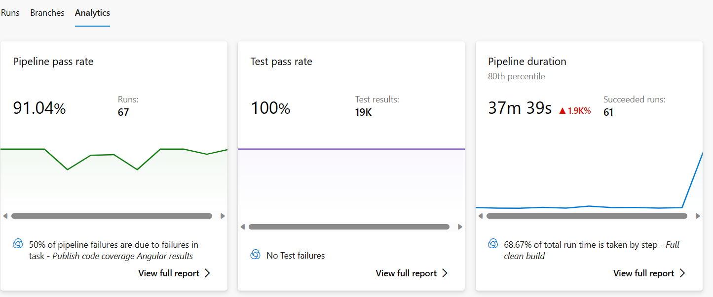
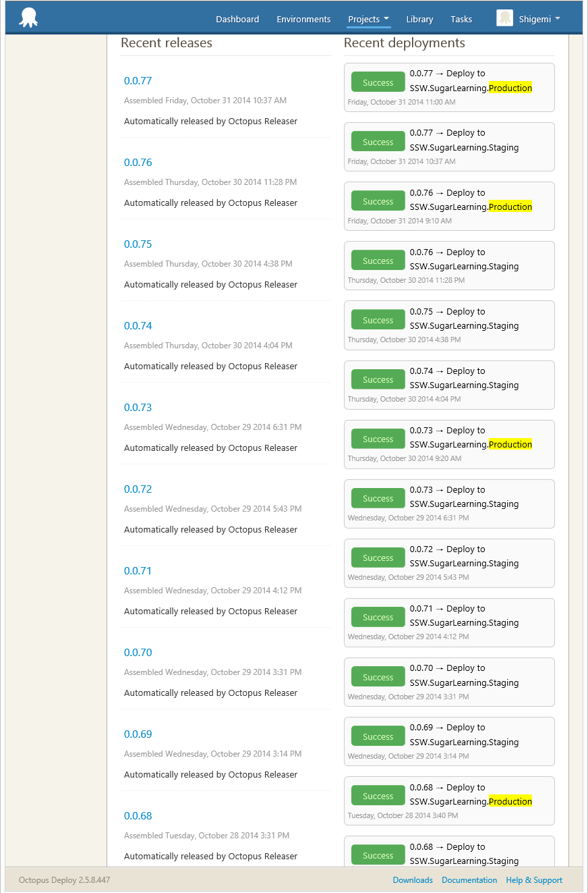

After any Sprint Review and Retrospective, an email should be sent to all the stakeholders to update them on the outcome from the Sprint:

<!--endintro-->

Firstly, create a new email copying the information from the previous Sprint Review/Retro. As per [Do you know what happens at a Sprint Retrospective meeting?](/do-you-know-what-happens-at-a-sprint-retrospective-meeting), it should include the following:

::: email-template
|          |     |
| -------- | --- |
| To:      | {{Product Owner}} |
| Cc:      | {{Sprint Review Attendees}}, {{Sprint Review Reporting Email}} |
| Subject: | {{Product Name}} - Sprint {{X}} Review/Retro |
::: email-content  

### Hi {{Product Owner}},

Here are the Sprint Goals and their status at a glance:

Sprint Goals (in priority order):

* Bugfixes – Done ✅
* WDM Integration – Done ✅
* SSO/Roles APIs – In Progress 🕑
* Download Documents APIs  – Not Done ❌

Please see below for a more detailed breakdown of the Sprint:

| Sprint in Review: | {{Sprint Number}}            |
| ----------------- | ---------------------------- |
| Sprint Duration:  | {{Number of weeks}}          |
| Project:          | {{Project Name}}             |
| Project Portal:   | {{Link to project Portal}}   |
| Test Environment: | {{Link to test environment}} |
| Product Owner:    | {{Product Owner Name}}       |

Attendees: *(Optional as they may be in the to and CC)*

### Sprint Review

| **ID** | **Title**                           | **State** | **Effort** |
| ------ | ----------------------------------- | --------- | ---------- |
| 24124  | UI Improvements                     | Done      | 4          |
| 24112  | Integrate Business Logic to MVC app | Done      | 8          |
| 24097  | Styling                             | Committed | 16         |

**Figure: Sprint Backlog from {{Link to Sprint Backlog in Azure DevOps}}** 

1. Sprint Burndown (a quick overview of the Sprint)

2. Code Coverage (hopefully tests are increasing each Sprint)
   XXX
3. Velocity *(Optional)*
   XXX
4. Burnup (for the release - the whole project, how are we tracking for the big picture?)

5. Build Pipeline Health & Production Deployments (How many times did we deploy to Production?)

   

6. Application Health Overview Timeline (For the entire Sprint)

7. Product Roadmap
Source: {{ ROADMAP LINK }}

Progress:

**{{ EPIC #1 }}**

- Currently {{ TOTAL # OF PBIS COMPLETED }}/{{ TOTAL # OF PBIS CREATED }} PBIs completed (there will be more)
  - {{ # OF PBIS COMPLETED THIS SPRINT }} Completed this Sprint
  - {{ # OF PBIS CREATED THIS SPRINT }}  Newly created this Sprint
  
**{{ EPIC #2 }}**

- Currently {{ TOTAL # OF PBIS COMPLETED }}/{{ TOTAL # OF PBIS CREATED }} PBIs completed (there will be more)
  - {{ # OF PBIS COMPLETED THIS SPRINT }} Completed this Sprint
  - {{ # OF PBIS CREATED THIS SPRINT }}  Newly created this Sprint

**{{ EPIC #3 }}**

- Currently {{ TOTAL # OF PBIS COMPLETED }}/{{ TOTAL # OF PBIS CREATED }} PBIs completed (there will be more)
  - {{ # OF PBIS COMPLETED THIS SPRINT }} Completed this Sprint
  - {{ # OF PBIS CREATED THIS SPRINT }}  Newly created this Sprint

### R&D

**Did we do any experimental work?**

{{Insert details of any trial/error processes, and ensure all detail is captured as per [https://ssw.com.au/rules/do-you-record-your-failures](/do-you-record-your-failures);}}

{{Insert details of any problems for which no solutions existed, and ensure detail is captured as per [https://ssw.com.au/rules/do-you-record-your-research-under-the-pbi](/do-you-record-your-research-under-the-pbi);}}

### Sprint Retrospective

As part of our commitment to inspect and adapt as a team we conduct a Sprint Retrospective at the end of every Sprint. Here are the results of our Sprint Retrospective:

✅ **What went well?** 

{{ INSERT LIST OF WHAT WENT WELL from Retro }}

❌ **What didn’t go so well?** 

{{ INSERT LIST OF WHAT NOT WENT WELL from Retro }}

💡 **What improvements will be made for the next Sprint?** 

{{ INSERT LIST OF IMPROVEMENTS to be made for the next Sprint }}

**Definition of Ready** *(Optional)*

{{ INSERT DEFINITION OF READY (Normally saying that the PBIs are sized with Acceptance Criteria added) }} 

**Definition of Done** *(Optional)*

{{ INSERT DEFINITION OF DONE (Normally saying that it compiles, meets the acceptance criteria, and a test please has been sent if relevant) }} 

&lt; This is as per the rule [https://ssw.com.au/rules/sprint-review-retro-email](/sprint-review-retro-email) /&gt;

:::
:::  

::: good
Figure: Good example - Template for Sprint Review/Retro email
:::
