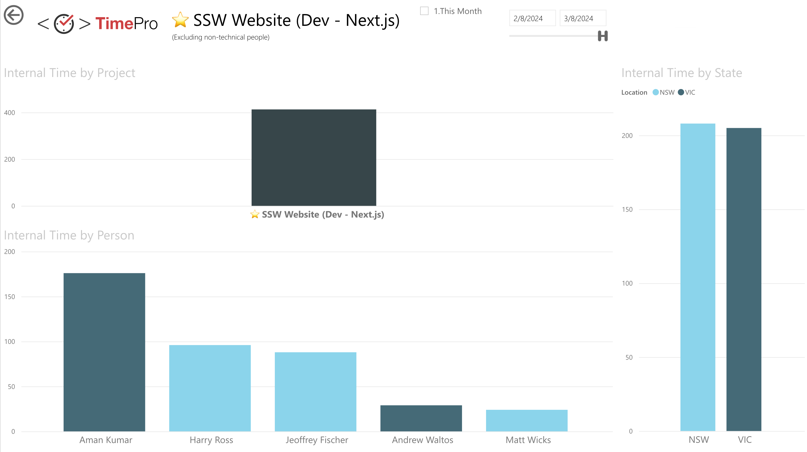
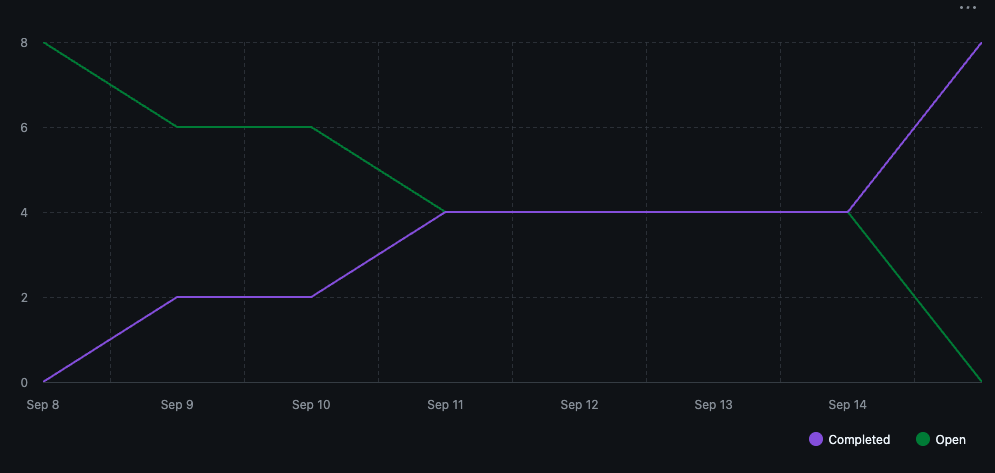
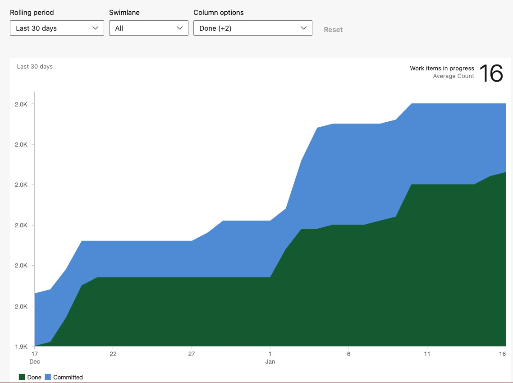
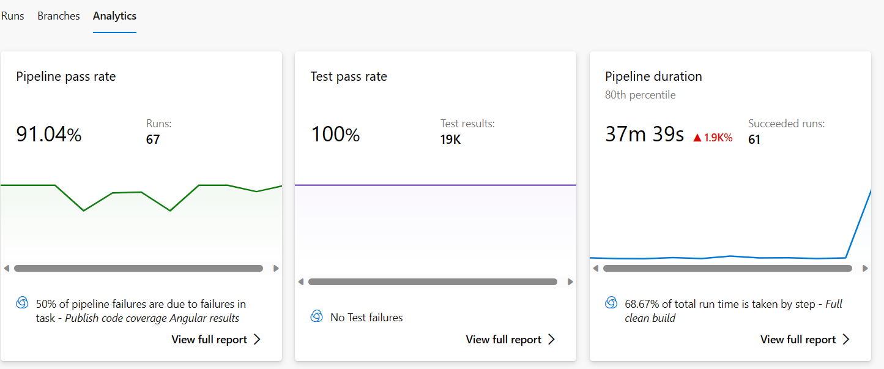
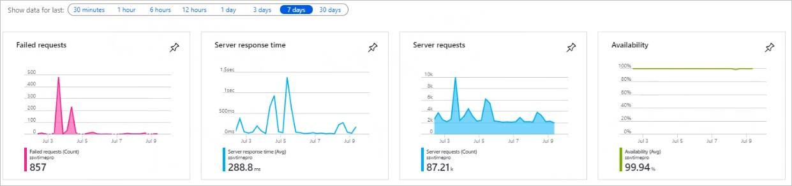
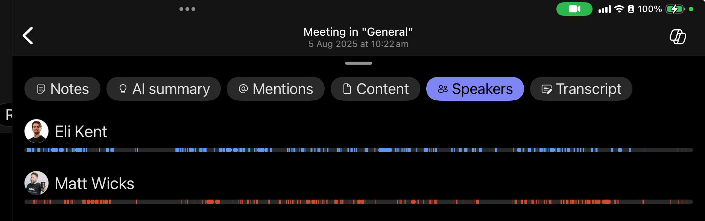
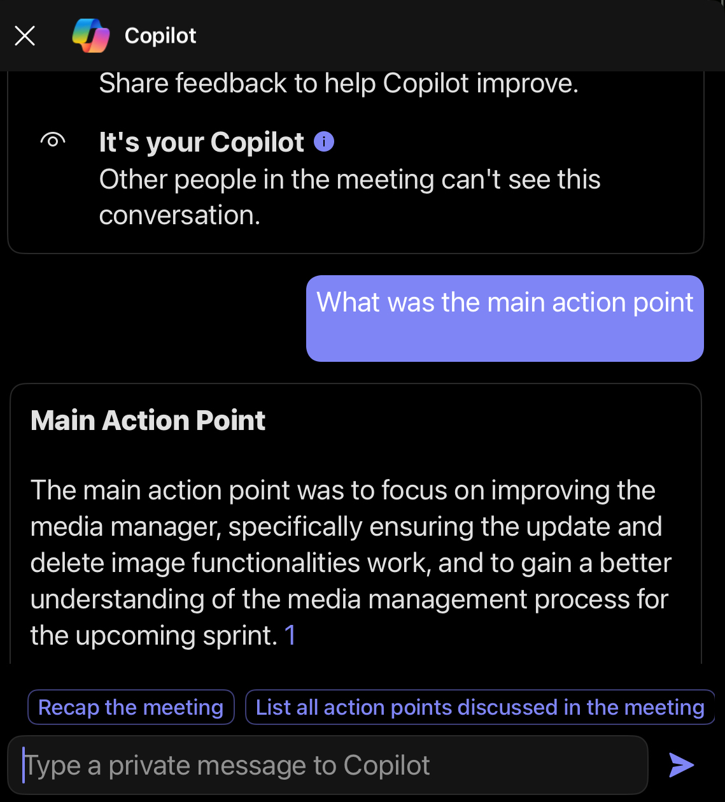
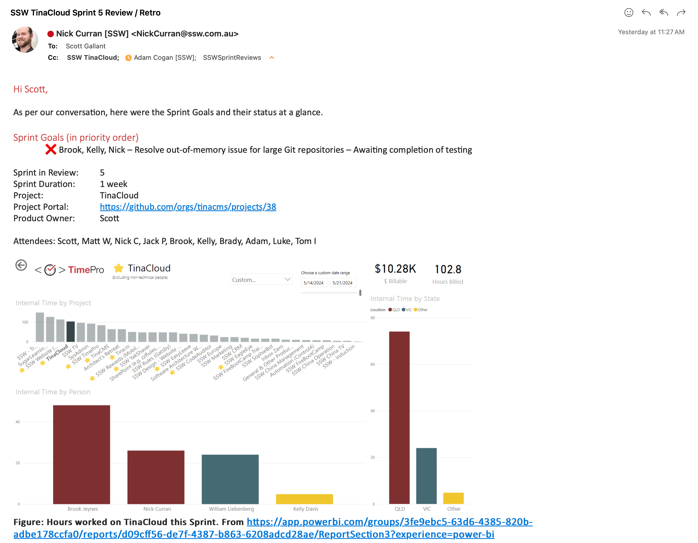

After any Sprint Review and Retrospective, an email should be sent to all the stakeholders to update them on the outcome from the Sprint.

<!--endintro-->

Learn more on [Do you know what happens at a Sprint Retrospective meeting?](/what-happens-at-retro-meetings)

Firstly, create a new email copying the information from the previous Sprint Review/Retro.

::: email-template

|          |     |
| -------- | --- |
| To:      | {{ PRODUCT OWNER }} |
| Cc:      | {{ SPRINT REVIEW ATTENDEES }}, {{ PROJECT GROUP EMAIL }}, {{ SPRINT REVIEW REPORTING EMAIL }} |
| Subject: | {{ PRODUCT NAME }} - Sprint {{ X }} Review + Retro |
::: email-content

### Hi {{ PRODUCT OWNER }}

Here are the Sprint Goals and their status at a glance:

Sprint Goals (in priority order):

* {{ ✅/❌ }} {{ DONE? }} - {{ GOAL }}
* {{ ✅/❌ }} {{ DONE? }} - {{ GOAL }}

Please see below for a more detailed breakdown of the Sprint:

|                    |                                      |
| ------------------ | ------------------------------------ |
| Sprint in Review:  | {{ SPRINT NUMBER }}                  |
| Summary Recording: | {{ YOUTUBE PLAYLIST URL }}           |
| Sprint Duration:   | {{ NUMBER OF WEEKS }}                |
| Project:           | {{ PROJECT NAME }}                   |
| Project Portal:    | {{ LINK TO PROJECT PORTAL }}         |
| Test Environment:  | {{ LINK TO TEST ENVIRONMENT }}       |
| Product Owner:     | {{ PRODUCT OWNER NAME }}             |
| Attendees:         | {{ NAMES OF THE ATTENDEES }}         |
✅ I have added the relevant stakeholders as per [Do you know what happens at a Sprint Review meeting?](/what-happens-at-a-sprint-review-meeting)

### Sprint Review

1. Timesheet data - Who worked in the Sprint?

2. What got done?

| **ID**   | **Title**       | **Assignee**   | **State**   | **Effort**   |
| -------- | --------------- | -------------- | ----------- | ------------ |
| {{ ID }} | {{ PBI TITLE }} | {{ ASSIGNEE }} | {{ STATE }} | {{ EFFORT }} |
| {{ ID }} | {{ PBI TITLE }} | {{ ASSIGNEE }} | {{ STATE }} | {{ EFFORT }} |

**Figure: Sprint Backlog from {{ LINK TO SPRINT BACKLOG }}**

3. Sprint Burndown - A quick overview of the Sprint

4. Code Coverage - Hopefully tests are increasing each Sprint

{{ CODE COVERAGE }}

5. Velocity *(Optional)*

{{ VELOCITY }}

6. Burnup - How are we tracking for the big picture? *

| Metrics – last 30 days | Count |
| --- | --- |
| New PBIs | {{ NEW PBIS }} |
| AI PBIS | {{ PBIS CREATED WITH AI }} ( {{ PERCENT OF NEW PBIS CREATED WITH AI }} %) |
| Completed PBIs | {{ PBIS COMPLETED }} |
| Net Change in PBIs | {{ +/- OVERALL PBI COUNT CHANGE }} |

**Figure: Backlog stats from [the stats generator](https://backlog-sprint-tool.vercel.app/) (GitHub only)**

7. Build Pipeline Health & Production Deployments - How many times did we deploy to Production?

8. Application Health Overview Timeline - For the entire Sprint

9. Product Roadmap

{{ ROADMAP LINK }}

Progress:

**{{ EPIC #1 }}**

* Currently {{ TOTAL # OF PBIS COMPLETED }}/{{ TOTAL # OF PBIS CREATED }} PBIs completed (there will be more)

  * {{ # OF PBIS COMPLETED THIS SPRINT }} Completed this Sprint
  * {{ # OF PBIS CREATED THIS SPRINT }}  Newly created this Sprint

*Add this for each current epic in your backlog*

10. R&D - Did we do any experimental work?

{{ INSERT DETAILS of any trial/error processes, and ensure all detail is captured as per [https://ssw.com.au/rules/do-you-record-your-failures](/do-you-record-your-failures) }}

{{ INSERT DETAILS of any problems for which no solutions existed, and ensure detail is captured as per [https://ssw.com.au/rules/do-you-record-your-research-under-the-pbi](/do-you-record-your-research-under-the-pbi) }}

11. AI use - what tools did you use?

* {{ PERSON }} - {{ TOOLS }}

#### Copilot Stats

### Sprint Retrospective

As part of our commitment to inspect and adapt as a team we conduct a Sprint Retrospective at the end of every Sprint. Here are the results of our Sprint Retrospective:

✅ **What went well?**

{{ INSERT LIST OF WHAT WENT WELL from Retro }}

❌ **What didn’t go so well?**

{{ INSERT LIST OF WHAT NOT WENT WELL from Retro }}

💡 **What improvements will be made for the next Sprint?**

{{ INSERT LIST OF IMPROVEMENTS to be made for the next Sprint }}

⚠️ **Do any 'For the Record' emails need to be sent?** *(Optional)*

As per <https://www.ssw.com.au/rules/for-the-record/>

{{ INSERT LIST OF 'FOR THE RECORD' EMAILS TO BE SENT }}

**Definition of Ready** *(Optional)*

{{ INSERT DEFINITION OF READY (Normally saying that the PBIs are sized with Acceptance Criteria added) }}

**Definition of Done** *(Optional)*

{{ INSERT DEFINITION OF DONE (Normally saying that it compiles, meets the acceptance criteria, and a test please has been sent if relevant) }}

&lt; This is as per the rule [https://ssw.com.au/rules/sprint-review-retro-email](/sprint-review-retro-email) /&gt;

:::
:::

::: good
Figure: Good example - Template for Sprint Review/Retro email
:::

::: info
**Note:** It's important that an [Email Group](/groups-in-microsoft-365/#microsoft-365-groups) is setup for the project, and the Sprint Review is sent to that group, so that anyone who joins the project in future can access these reports from shared inbox as per [Do you choose which Microsoft 365 Groups you follow?](/following-microsoft-365-groups)
:::

::: info
**Tip:** Move all Dones to the top of your Sprint backlog to make it easier to digest the progress for the Product Owner.
:::

::: good

:::

## Recording Review and Retrospective Meetings

Creating a comprehensive summary and recording of your Sprint Meeting is a great way to communicate changes in a product to the community and stakeholders — especially for those unable to attend. See [Do you record a summary of Sprint Meetings?](/summary-recording-sprint-reviews) for details.

`youtube: https://www.youtube.com/watch?v=d1-5wziOH7o`
**Video: ✅ Good Example: Nick C in TinaCMS - Sprint 55 Review + Retro and Sprint 56 Forecast (9 min)**

`youtube: https://www.youtube.com/watch?v=eqc_fKk2ZFo`
**Video: ✅ Good Example: Josh B in Tina.io - Sprint Review 48 & Forecast 49 (13 min)**
