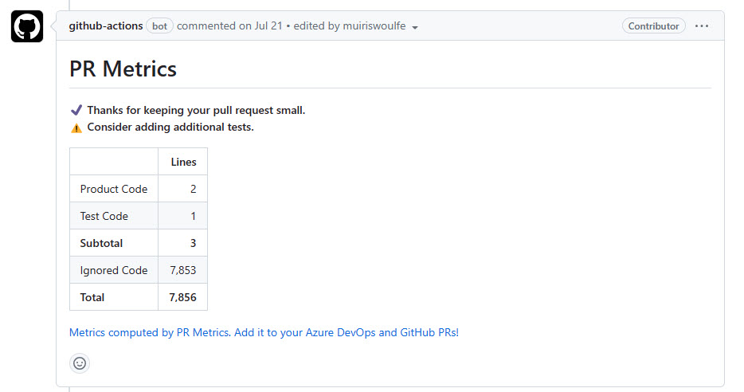
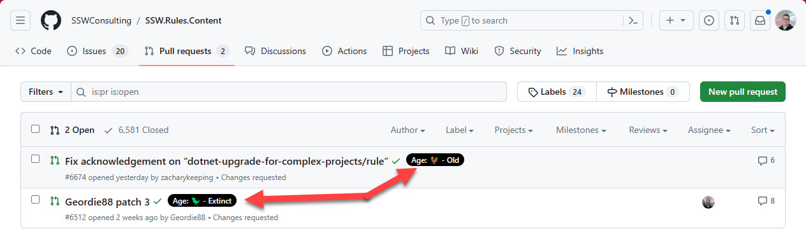
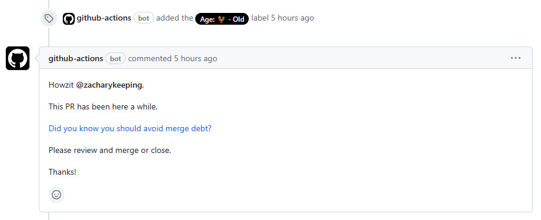

Getting started with a new repository can be daunting, especially if you are new to the project. Having a standard set of pull request workflows can help you get started and make sure you are following the same process as everyone else on the team.

A few standard workflows helps developers see a consistent process across all repositories. This makes it easier for developers to get started with a new repository and makes it easier for developers to move between repositories as the feedback they get from each pull request is consistent.

<!--endintro-->

Below are a few standard workflows that you can use in your repositories.

### PR - t-shirt size the pr

This workflow uses the [microsoft/PR-Metrics](https://github.com/microsoft/PR-Metrics) action to update each pull request with information that helps ensure engineers keep PRs to an appropriate size with appropriate test coverage, while informing reviewers of the expected time commitment for a thorough review of the code.

You can find the workflow at [SSWConsulting/SSW.GitHub.Template/.github/workflows/pr-metrics.yml](https://github.com/SSWConsulting/SSW.GitHub.Template/blob/main/.github/workflows/pr-metrics.yml)

### PR - Manage Stale PRs

This workflow creates adds labels to pull requests as they age.

The workflow will also ping the author of the pull request after around 36 hours and remind them about [merge debt](/merge-debt/)

You can find the workflow at [SSWConsulting/SSW.GitHub.Template/.github/workflows/pr-manage-stale.yml](https://github.com/SSWConsulting/SSW.GitHub.Template/blob/main/.github/workflows/pr-manage-stale.yml)
