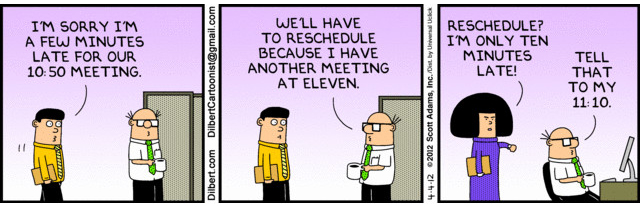

Keeping to your meeting’s timebox shows that you respect your attendees, and allows for you and them to be efficient and able to plan their days effectively. One meeting going over by 30 minutes can have knock on effects for the rest of the day, and a culture of this will create that feeling of “meeting dread” that can be so common.

Always start your meetings on time. Especially for meetings that are regular, as it will teach your attendees that they need to be there from the start, and they will not be waited for.

<!--endintro-->

You can (and should) still have a few minutes of informal conversation at the beginning and end of each meeting, but don’t let it get out of hand.

