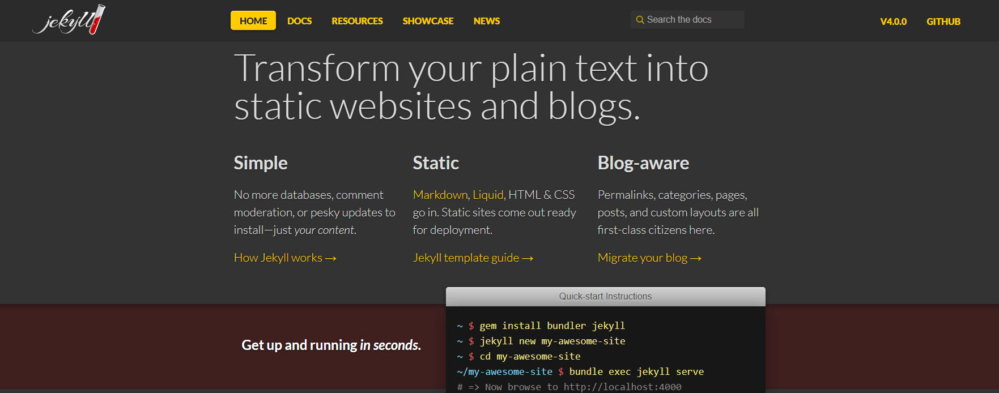
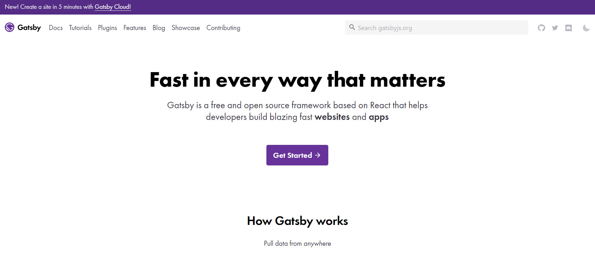

**TODO Matt. W** .: Flesh out rule content

<!--endintro-->

::: bad
Bad Example: Jekyll - Great but too simple

:::

::: bad
Bad Example: NextJS - We had reliability issues with page generation

:::

::: good
Good Example: Gatsby

:::

Gatsby is great because it's simple and yet powerful. It works natively with GitHub as a Datasource and you can query via GraphQL based on Tags and Branches.
