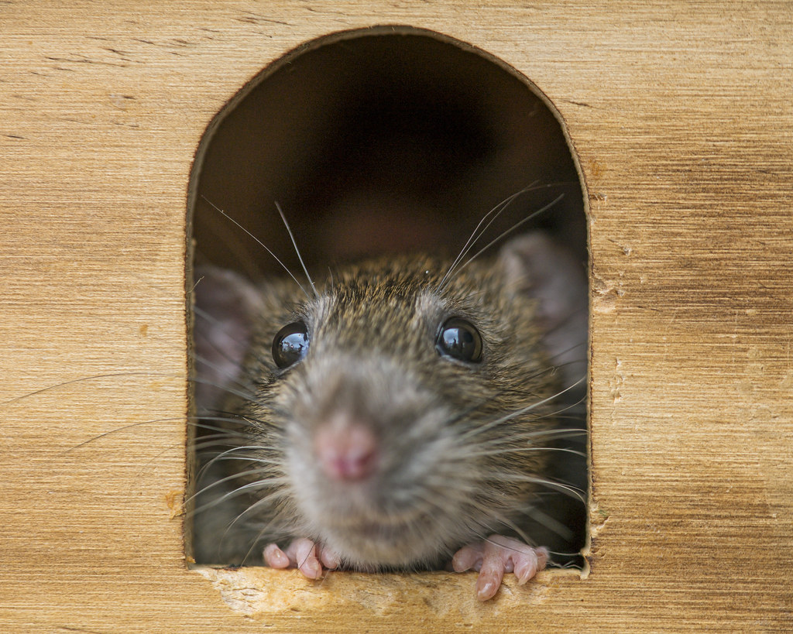

Any good meeting has a clear goal, and an agenda that breaks that goal up into items that are “For information,” “For discussion,” or “For decision”. 

<!--endintro-->

A few other ways to make the most of the attendees' time would be:

* The early part of a meeting tends to be more lively and creative than the end of it, so if an item needs mental energy, bright ideas, and clear heads, put it high up on the list
* Start with the low hanging fruit so you get some decisions made
* Keep the important topics closer to the front, than the end
* Some items unite the meeting while others divide the members. The leader may want to start with unity before entering into division, or they may prefer the other way around. The point is to be aware of the choice and to make it consciously. It is always a good idea to end the meeting on a unifying item
* Don’t get side-tracked for too long by urgent, but not important, items. Keep non-important topics timeboxed
* If your meeting is more than an hour or two, consider adding a break
* To improve future meetings, at the end of the meeting, do a quick debrief (aka retro) to see how long the meeting took, if anything was covered that didn't need to be, etc.

::: greybox
⭐ **Tip:** A meeting if better without going down rat holes… Start a meeting with 
“Who will be the scribe so we can take notes of side issues?  Let’s aim to keen on track and avoid rat holes”

:::