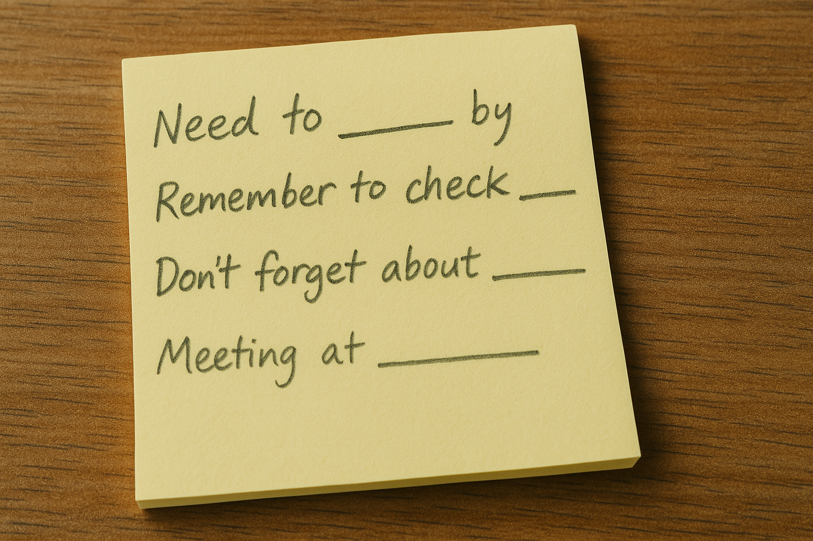
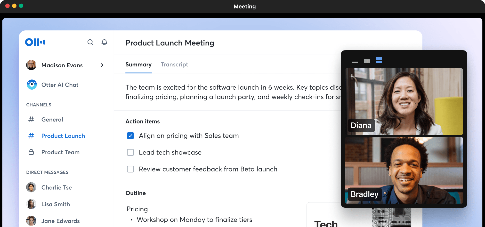

Manually typing out meeting notes is slow, error-prone, and distracting. While you’re typing, you’re likely missing parts of the discussion and contributing less. Worse, you might spend time afterward cleaning up notes instead of acting on them. 

In fact, employees estimate that [37% of their biggest cost is wasted time in meetings](https://joingenius.com/statistics/meeting-statistics/), and context-switching after interruptions takes an average of [9 minutes to recover from](https://www.atlassian.com/blog/productivity/context-switching).

**Manual notetaking multiplies both problems.**

<!--endintro-->

### Why manual notes fall short

**❌ You fall behind:** Fast conversations are hard to track while you type.

**❌ You lose focus:** Note-takers often miss critical context or fail to contribute.

**❌ You waste recovery time:** Switching between listening and typing is cognitively expensive.

**❌ You still have to format, organize, and send the notes afterward.**

### Why AI note-takers are better

AI transcription tools like **Read AI**, **Otter.ai**, and **Fireflies.ai** handle notetaking for you, with:

* **Speed** – Get transcripts and summaries within seconds of the meeting ending.
* **Accuracy** – Capture every word, no typos or forgotten context.
* **Talk-time metrics** – See how much each participant contributed.
* **Automated follow-up** – Receive email summaries with action items and highlights.

| Feature                       | Read AI                               | Otter.ai                            | Fireflies.ai                          |
| ----------------------------- | ------------------------------------- | ----------------------------------- | ------------------------------------- |
| **Real-time Transcription**   | ✅ Yes                                 | ✅ Yes                               | ✅ Yes                                 |
| **AI Meeting Summary**        | ✅ Yes (Detailed, Topic-based)         | ✅ Yes (Concise)                     | ✅ Yes (Customizable)                  |
| **Action Item Detection**     | ✅ Yes (AI-powered)                    | ✅ Yes (Keyword-based)               | ✅ Yes (AI-powered)                    |
| **Talk Time % Analysis**      | ✅ Yes (With engagement metrics)       | ✅ Yes                               | ✅ Yes (Talk/Listen Ratio)             |
| **Speaker Coaching/Feedback** | ✅ Yes                                 | 🟠 Limited                          | 🟠 Limited                            |
| **Automated Email Summary**   | ✅ Yes (Integrated with GMail/Outlook) | ✅ Yes                               | ✅ Yes                                 |
| **Key Integrations**          | Zoom, Teams, Meet, Calendar           | Zoom, Teams, Meet, Calendar         | Zoom, Teams, Meet, Calendar, **CRMs** |
| **Primary Strength**          | **Meeting Insights & Coaching**       | **Core Transcription & Simplicity** | **Integrations & Customization**      |

### 5-minute setup to modernize your meetings

1. Create a Read AI (or similar) account.
2. Connect your calendar and meeting platform.
3. Invite your AI notetaker to the call.
4. After the call, check your inbox for a full summary.
5. Share the summary in Teams or Slack.

::: info\
**Important:** Always inform attendees if the call is being recorded or transcribed. Consent is required in most regions.
:::

### Conclusion

Free yourself (and your team) from the burden of manual note-taking. Let AI do the heavy lifting so you can stay present, contribute more, and act faster after the meeting.
