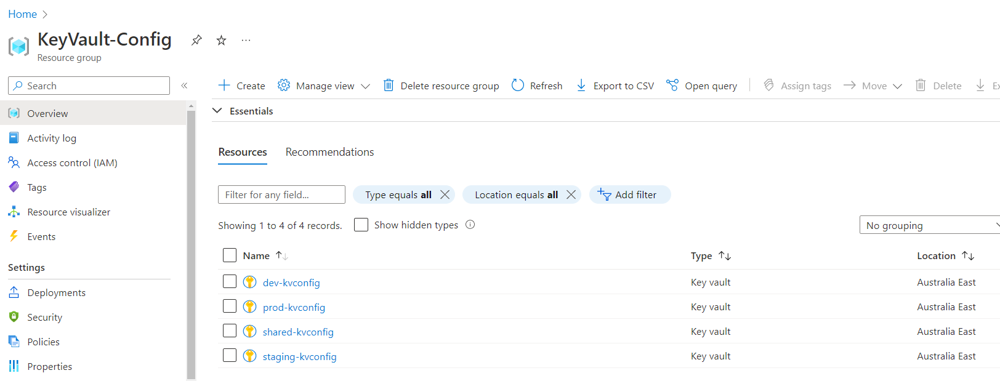

When creating pipelines for a company there is often secrets that need to be used by more than 1 repository. This is something that GitHub can't do natively. A developer is also unable to read the secrets in GitHub once they are entered. Although this is for security a simple typo can't be found and instead the entire secret needs to be reentered. There is also no visible history for GitHub secrets and no ability to revert to an earlier version of a secret.

Solution: Store them in Azure KeyVault.

<!--endintro-->

### Create the KeyVaults

1. Create a seperate Resource Group in Azure
2. Add 1 x shared KeyVault - These will store any values that would be the same no matter which environment you are deploying to.
3. Add 1 KeyVault for each environment you will deploy to - These are to store any values that are specific to the development environment (i.e. dev, staging, prod)

::: good

:::

### Use the KeyVaults in your CICD pipeline

1. In a GitHub action use the following code:

``` yaml
- name: Azure CLI script
  uses: azure/CLI@v1
  with:
    inlineScript: |
      az keyvault secret show --vault-name dev-kvconfig --name myAppInsightsKey --query value
``` 
**Figure: Retrieve KeyVault Secrets to use in GitHub Actions**

2. Bicep - In the file that you wish to use a secret add this code:

``` json
resource environmentKeyVault 'Microsoft.KeyVault/vaults@2022-07-01' existing = {
  name: '${environmentName}-kvconfig'
  scope: resourceGroup(envSubscriptionId, envResourceGroup)
}

```

Then reference the value like this to provide parameters for other bicep modules:

``` json
module azuredeployment 'environment-keyvault.bicep' ={
  name: '${projectName}-${lastDeploymentDate}'
  scope: resourceGroup()
  params: {
    location: location
  
    tags: tags
    AppInsightsKey: environmentKeyVault.getSecret('myAppInsightsKey')
}
```
**Figure: Retrieve KeyVault Secrets using Bicep**

3. PowerShell - Access the same secrets directly from PowerShell:

``` powershell
Get-AzKeyVaultSecret -VaultName "$environmentName-kvconfig" -Name myAppInsightsKey -AsPlainText
```
**Figure: Retrieve KeyVault Secrets using PowerShell**
