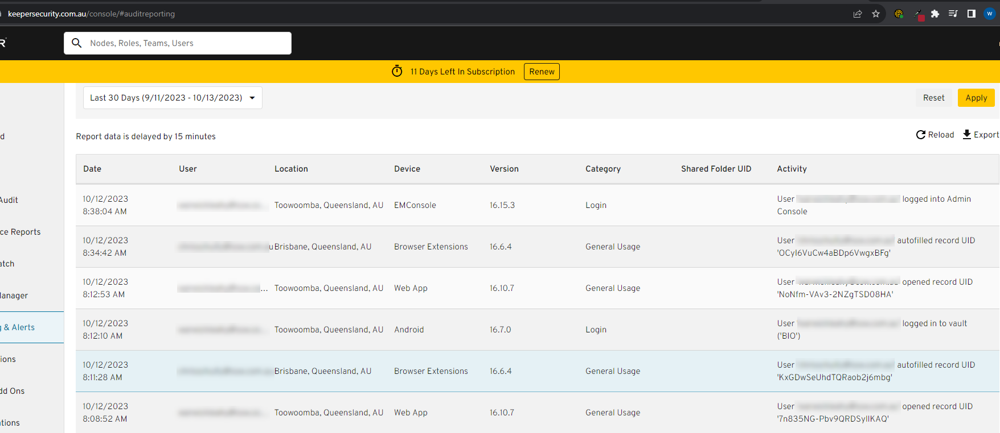

Storing sensitive information such as credit card details and passport information in an unsecured location poses significant risks, not only for the individuals whose information is stored but also for the organization responsible for that data.

Ideally don't keep these kinds of details at all.  However that isn't always practical; busy managers and CEOs often need to be able to share them with admin staff easily so that they can (e.g.) book flights and arrange travel for them.  They don't want to be always getting out their cards.         

<!--endintro-->

### **Data Breach Risks**

* Credit card information and passport details are highly sought-after by cybercriminals. When this data is stored in an unsecure manner, the likelihood of it being accessed and misused by unauthorized parties increases significantly.
* Should a data breach occur, the organization could face severe reputational damage, legal consequences, and financial penalties. https://www.oaic.gov.au/about-the-OAIC/our-regulatory-approach/guide-to-privacy-regulatory-action/chapter-7-privacy-assessments

### **Non-compliance with Data Protection Regulations**

* Global and regional data protection regulations, such as GDPR in Europe, CCPA in California, and the Australian Privacy Principles (APPs) under the Privacy Act 1988 in Australia, mandate strict guidelines on how personal and sensitive data should be stored and protected.
* Storing such sensitive information in an insecure manner is a direct violation of these regulations, leading to hefty fines and legal action. 

### **Data Integrity and Management Issues**

* Over time, unstructured and unsecured data can become outdated, redundant, or even be altered unintentionally.
* Using Dynamics 365's notes field for such data means there's no systematic way to track its accuracy, validity, or history.
  ::: bad
  
::: 
# **Store details in an Enterprise Password Manager like Keeper**

* **End-to-end Encryption**: Keeper ensures that sensitive information is encrypted both in transit and at rest, using advanced encryption algorithms.
* **Role-Based Access Control**: Only authorized personnel can access and manage sensitive data. This ensures that sensitive information is not accidentally or intentionally accessed by unauthorized parties.

   
::: good
  
:::
Even better from an enterprise password manager like Keeper sensitive details can be OneTime shared for a short time period on an ad-hoc basis.
::: good

:::
* **Auditing and Reporting**: Keeper provides detailed logs and reports, allowing for complete oversight and management of all data stored within.
::: good
  
:::
* **Regulatory Compliance**: With tools and features designed to aid organizations in complying with data protection regulations, enterprise password managers like Keeper ensure that sensitive information is handled according to global standards, including Australian Privacy Principles (APPs).
* **Data Integrity**: With structured data management, sensitive data stored in Keeper remains consistent, accurate, and up-to-date.

Storing credit card details, passport information, or any sensitive data in Dynamics 365's notes or similar unsecured fields exposes the organization to unnecessary risks. Leveraging enterprise password managers like Keeper ensures that this data is stored securely, is compliant with data protection regulations, including the Australian Privacy Principles (APPs), and is easily manageable.
