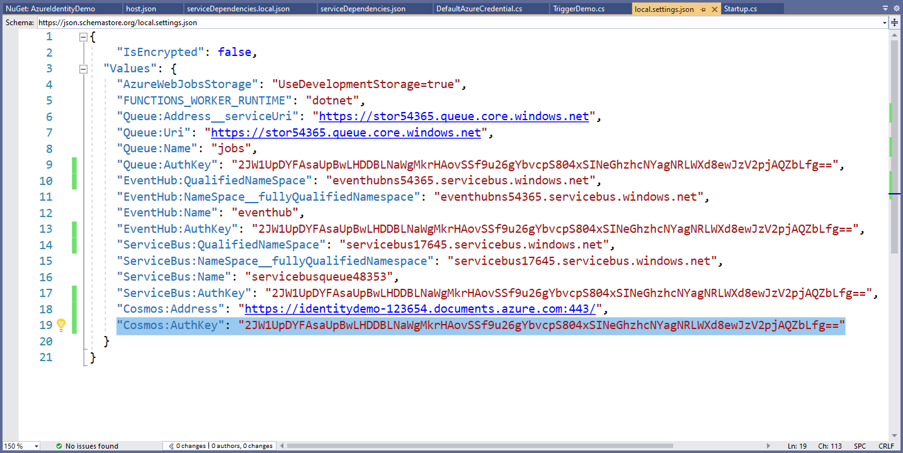
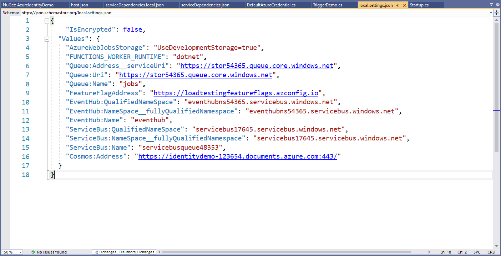

Most systems will have variables that need to be stored securely; OpenId shared secret keys, connection strings, and API tokens to name a few.

These secrets **must not** be stored in source control. It is insecure  and means they are sitting out in the open, wherever code has been downloaded, for anyone to see.

<!--endintro-->

There are many options for managing secrets in a secure way:

### Bad Practices

::: greybox

#### Store production passwords in source control

Pros:

* Minimal change to existing process
* Simple and easy to understand

Cons:

* Passwords are readable by anyone who has either source code or access to source control
* Difficult to manage production and non-production config settings
* Developers can read and access the production password

:::
::: bad
Figure: Bad practice - Overall rating: 1/10
:::

::: greybox

#### Store production passwords in source control protected with the [ASP.NET IIS Registration Tool](https://docs.microsoft.com/en-us/previous-versions/zhhddkxy(v=vs.140)?redirectedfrom=MSDN)

Pros:

* Minimal change to existing process – no need for [DPAPI](https://docs.microsoft.com/en-us/aspnet/core/security/data-protection/introduction?view=aspnetcore-5.0) or a dedicated Release Management (RM) tool
* Simple and easy to understand

Cons:

* Need to manually give the app pool identity ability to read the default RSA key container
* Difficult to manage production and non-production config settings
* Developers can easily decrypt and access the production password
* Manual transmission of the password from the key store to the encrypted config file

:::
::: bad
Figure: Bad practice - Overall rating: 2/10
:::

::: greybox

#### Use Windows Identity instead of username / password

Pros:

* Minimal change to existing process – no need for DPAPI or a dedicated RM tool
* Simple and easy to understand

Cons:

* Difficult to manage production and non-production config settings
* Not generally applicable to all secured resources
* Can hit firewall snags with Kerberos and AD ports
* Vulnerable to DOS attacks related to password lockout policies
* Has key-person reliance on network admin

:::
::: bad
Figure: Bad practice - Overall rating: 4/10
:::

::: greybox

#### [Use External Configuration Files](https://docs.microsoft.com/en-us/aspnet/identity/overview/features-api/best-practices-for-deploying-passwords-and-other-sensitive-data-to-aspnet-and-azure)

Pros:

* Simple to understand and implement

Cons:

* Makes setting up projects the first time very hard
* Easy to accidentally check the external config file into source control
* Still need DPAPI to protect the external config file
* No clear way to manage the DevOps process for external config files

:::

::: bad
Figure: Bad practice - Overall rating: 1/10
:::

### Good Practices

::: greybox

#### Use Octopus/ VSTS RM secret management, with passwords sourced from KeePass

Pros:

* Scalable and secure
* General industry best practice - great for organizations of most sizes below large corporate

Cons:

* Password reset process is still manual
* DPAPI still needed

:::
::: good
Figure: Good practice - Overall rating: 8/10
:::

::: greybox

#### Use Enterprise Secret Management Tool – Keeper, 1Password, LastPass, Hashicorp Vault, etc

Pros:

* Enterprise grade – supports cryptographically strong passwords, auditing of secret access and dynamic secrets
* Supports hierarchy of secrets
* API interface for interfacing with other tools
* Password transmission can be done without a human in the chain

Cons:

* More complex to install and administer
* DPAPI still needed for config files at rest

:::
::: good
Figure: Good practice -  Overall rating: 8/10
:::

::: greybox

#### Use .NET User Secrets

Pros:

* Simple secret management for development environments
* Keeps secrets out of version control

Cons:

* Not suitable for production environments

:::
::: good
Figure: Good Practice - Overall rating 8/10
:::

::: greybox

#### Use Azure Key Vault

See the [SSW Rewards](https://www.ssw.com.au/ssw/Rewards/) mobile app repository for how SSW is using this in a production application: <https://github.com/SSWConsulting/SSW.Rewards>

Pros:

* Enterprise grade
* Uses industry standard best encryption
* Dynamically cycles secrets
* Access granted based on Azure AD permissions - no need to 'securely' share passwords with colleagues
* Can be used to inject secrets in your CI/CD pipelines for non-cloud solutions
* Can be used by on-premise applications (more configuration - see [Use Application ID and X.509 certificate for non-Azure-hosted apps](https://learn.microsoft.com/en-us/aspnet/core/security/key-vault-configuration?view=aspnetcore-7.0#use-application-id-and-x509-certificate-for-non-azure-hosted-apps))

Cons:

* Tightly integrated into Azure so if you are running on another provider or on premises, this may be a concern. Authentication into Key Vault now needs to be secured.

:::
::: good
Figure: Good Practice - Overall rating 9/10
:::

::: greybox

#### Avoid using secrets with Azure Managed Identities

The easiest way to manage secrets is not to have them in the first place. Azure Managed Identities allows you to assign an Azure AD identity to your application and then allow it to use its identity to log in to other services. This avoids the need for any secrets to be stored.

Pros:

* Best solution for cloud (Azure) solutions
* Enterprise grade
* Access granted based on Azure AD permissions - no need to 'securely' share passwords with colleagues
* Roles can be granted to your application your CI/CD pipelines at the time your services are deployed

Cons:

* Only works where Azure AD RBAC is available. NB. There are still some Azure services that don't yet support this. Most do though.

:::
::: good
Figure: Good Practice - Overall rating 10/10
:::

### Resources

The following resources show some concrete examples on how to apply the principles described:

* <https://github.com/brydeno/bicepsofsteel>
* <https://docs.microsoft.com/en-us/azure/key-vault/general/best-practices>
* <https://docs.microsoft.com/en-us/azure/key-vault/general/security-features>
* <https://docs.microsoft.com/en-us/aspnet/core/security/app-secrets?view=aspnetcore-5.0&tabs=windows>
* <https://docs.microsoft.com/en-us/sql/connect/ado-net/connection-strings-and-configuration-files?view=sql-server-ver15>
* <https://docs.microsoft.com/en-us/azure/azure-app-configuration/howto-integrate-azure-managed-service-identity?tabs=core5x>
* <https://www.youtube.com/watch?v=F9H0txgz0ns>
