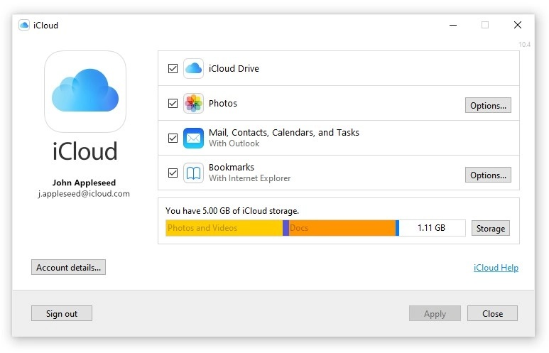
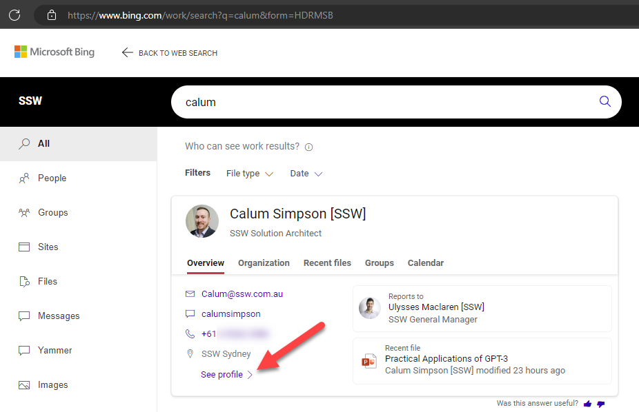

If you are like most people, you probably have a lot of contact information stored in various places: your phone, your email, your social media accounts, etc.

However, having your contacts scattered around can make it hard to find them when you need them, and can also increase the risk of losing them if something happens to one of your devices or accounts. That's why it's important to keep your contact information in one place and sync them between your devices. Here are some tips on how to do that.

<!--endintro-->

### Keep your contacts in one account

Where you choose to store your contacts will depend on the devices and accounts you primarily use - the most popular options would be iCloud for Apple devices, Google for Android devices (or if you primarily use Gmail), or a Microsoft account if you mostly use Outlook.

Whichever one you choose, there are ways to sync you contacts across devices - for example, if you mostly use Apple devices, you should keep your contacts in iCloud. If you also use Outlook on a Windows device, you can install [iCloud for Windows](https://support.apple.com/en-au/HT204283) to sync the contacts there.

### Keep your work contacts in your work account

The exception to the above is your work contacts - if you use a work email address or a work phone number, you should store your work-related contacts in a work account. This way, you can easily access them when you are working, and also separate them from your personal contacts. This can also help you avoid mixing up your work and personal communications, and protect your privacy and security.

Client contact information should be kept where your organization can access it, so it is not lost if you ever leave the organization. Note that you should not need to save your colleagues' contact details, as they should be available in your Global Address List - in fact, if you are using Microsoft 365, you can search for a colleague in Bing and see their info there.

### Keep your contacts updated and organized

Once you have your contacts in one place and synced between your devices, you should make sure they are updated and organized. You can do this by deleting any duplicates or outdated contacts, adding any missing information such as names, phone numbers, email addresses, etc., and grouping or labeling your contacts by categories such as family, friends, colleagues, clients, etc. This can help you find the right contact quickly and easily when you need to communicate with them.
