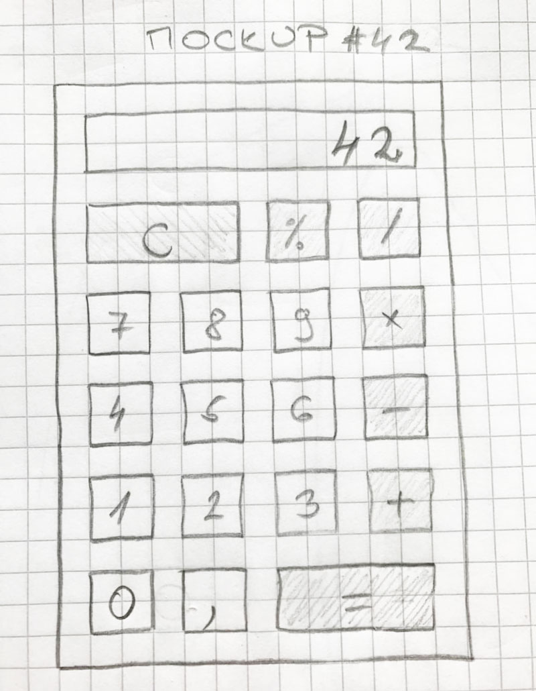
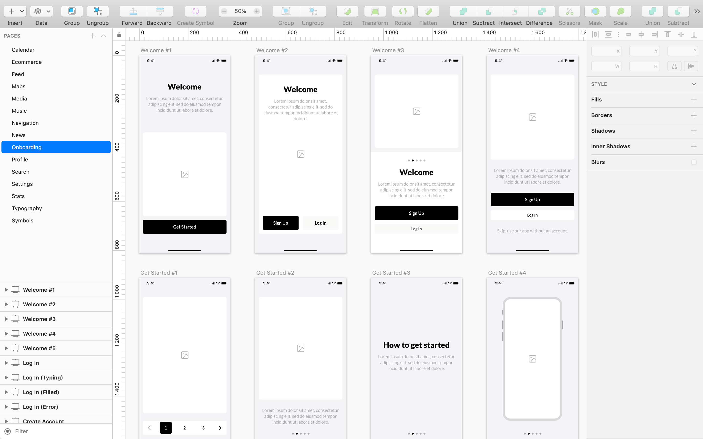
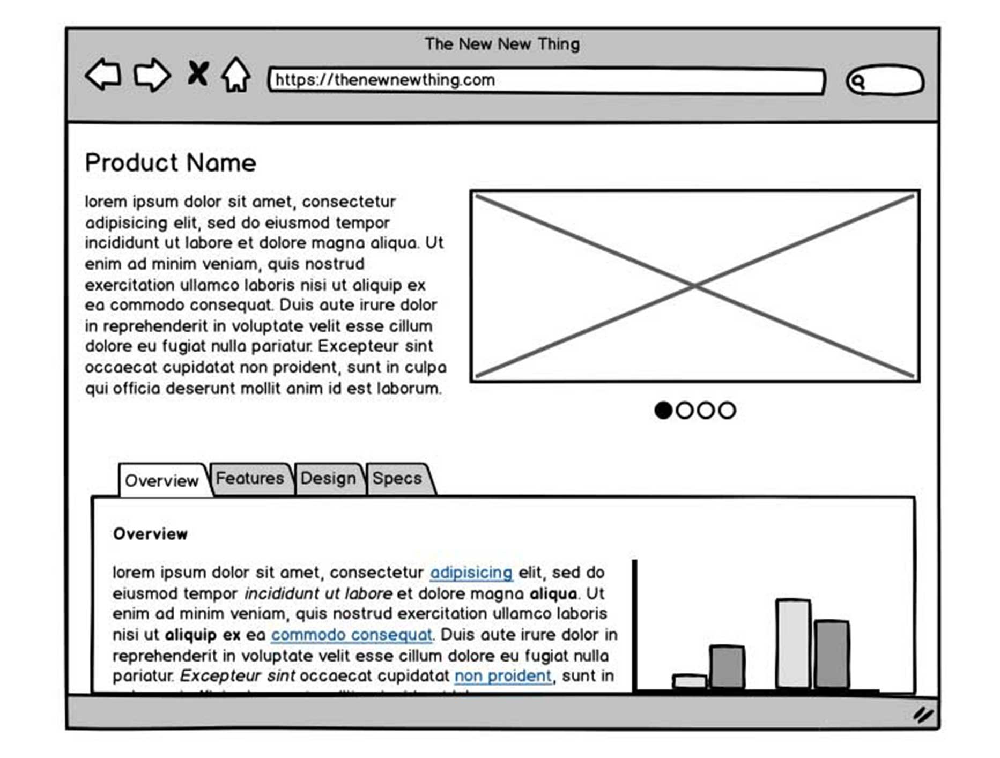
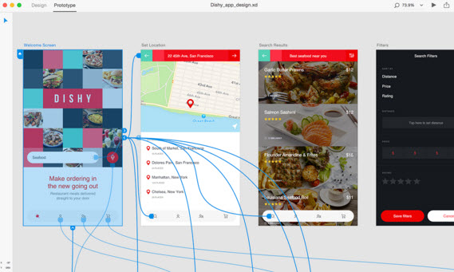
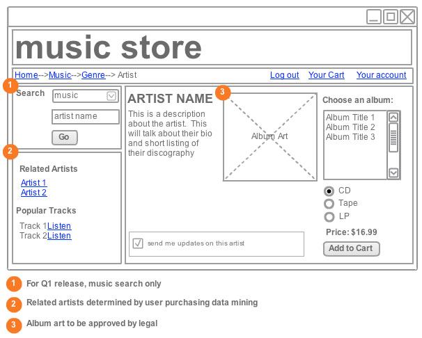
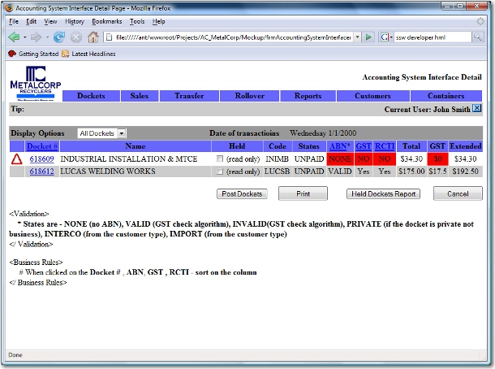
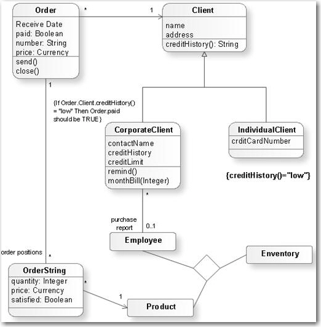

Complex documentation can waste time. Many user requirements can be best encapsulated in screen mock-ups. When the mockups of each screen of the app or website are put together then you have a storyboard. 

<!--endintro-->

There are 3 primary types of mockups:

1. **Hand-drawn Mockups**
2. **Designer Photoshop Mockups** (recommended)
3. **Wireframe Mockups**

Often it's best to start with some hand-drawn ones to get started. Then if you have access to designers, complete a couple of full 'Designer Photoshop Mockups' for "look and feel" approval, then complete the storyboard as wireframes.

### Hand-drawn Mockups

'Hand drawn Mockups' are recommended to be done with the customer. Since it doesn't deal with any styling/color issues, 'Photoshop Mockups' will be needed after.

### Designer Mockups

These are concept mockups produced by designers in Photoshop providing guidance for the final look with full styling.

::: greybox

**Warning:** Don't go down the track of giving a customer a few concepts (on some projects we gave 2 or 3 completely different concepts by different designers). There becomes too much mixing and matching when they see them. Once the images are approved, then the designers slice them up and turn them into HTML (slicing is the exporting of each image).

:::

### Wireframe Mockups

A layout of how the controls will look is usually all that is needed initially, without worrying about images. [An example of a Wireframe Mockup](https://www.appschopper.com/blog/wp-content/uploads/2021/09/UIUX-Design-AppsChopper.png)

**Tip:** The tools to develop a wireframe depend on your skillset and the front end technology chosen. For example use:

* Figma (Recommended)
  
* Microsoft PowerPoint (ubiquitous)
* [Balsamiq](http://www.balsamiq.com/)
    
* [Adobe XD](http://www.adobe.com/au/products/experience-design.html) - preloaded with the most popular UI design blocks  **(recommended for web & mobile app design)**
    

### More information – Add notes at the bottom

Wireframes should include numbers (in circles) and notes at the bottom, explaining features and/or indicating priority.

::: good

:::

Mock-ups notes should also include the business rules that apply to the page. If there are a lot of rules then it is acceptable to link off to a Microsoft Word document.

::: good

:::

### Others

* [Sketch](https://www.sketchapp.com/) (Mac Only and for UX designers)
* [Moqups](https://moqups.com/) (HTML5 based App)
* [UXPin](http://uxpin.com/) (more sophisticated, helps you create responsive designs)

### Don't use UML - it is virtually impossible to get clients to understand these

::: bad

:::

UML is not all bad. UML and other formal documentation methods can be useful for developers.

The overarching problem is it gets out of date, so it gathers dust (aka Technical Debt). A better way of getting documentation is to flesh out the classes and use the VS Dependency Graph or NDepend. A demo can be seen in ["A Modern Architecture Review" presentation](https://www.slideshare.net/SSWconsulting/a-modern-architecturereviewusingcodereviewtools).

### Summary

Mock-ups and wireframes have more clarity than bulky design documents.

For example, to communicate that “a customer has many phone numbers”, a storyboard/wireframe of how that relationship will appear in the user interface is highly more likely to be understood by the client.

Clear communication of the message is more important than the medium used to convey that message.

::: greybox

Here are some more hot tips on mock-ups:

* Avoid the thought of a "throw-away" prototype. An example of a throwaway prototype is when you design screens in Access, but the application will be HTML. So design the screens you and the customer are happy with the technology you will be using, and then use them in the app.
* It is best to have a designer and developer and customer working together.
* Get the mock-ups [physically initialed](/tasks-do-you-know-to-ensure-that-relevant-emails-are-attached-to-tasks), especially if you are performing a fixed-price contract. Yes, paperless is great - but not in this case.
* If you can't get mock-ups initialed, then page by page approval over email is the 2nd best option.
* A tip I picked up from Tom Howe was to always add a client's branding into the mockup - it makes a big impression
* Mock-ups should follow [standard interface rules](/rules-to-better-interfaces-general-usability-practices)
* Write the related business rules at the bottom of each screen - and turn into unit tests.

:::