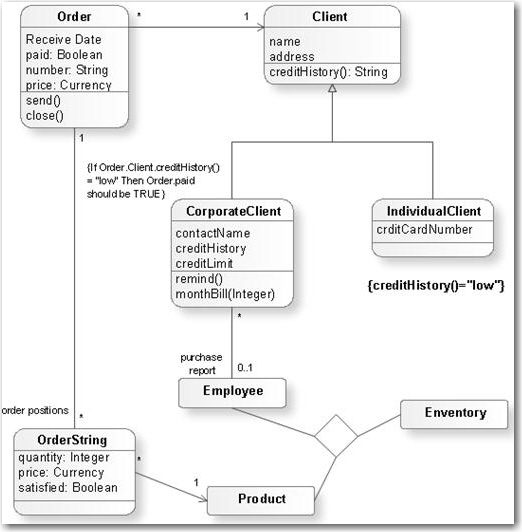

Developers often arrive at client meetings armed with a bunch of impressive software design and architecture documents. When they present these materials to the client, there is often confusion or difficulty in grasping the content.
 
Storyboarding solves this pain by giving the client a visual representation of requirements. This representation helps the client 'feel' the value and prevents miscommunications as the product is developed. 

Crafting a UX storyboard does not require artistic skill, it only needs to be a rough sketch that shows the sequence of events. They help developers and stakeholders understand what the UX and user scenarios will be, and are usually included in Spec Reviews. 

Storyboarding first became popular as a tool in motion picture production.

<!--endintro-->

### Why isn't UML sufficient?

Many people use UML (Unified Modeling Language) to specify, construct, and document the various aspects of software systems. UML serve a purpose for helping developers understand what to do technically. However, for the clients a UML diagram is often hard to digest.

::: bad

:::

On the other hand, Storyboarding is an effective way to capture, convey, and explore different user experiences.

::: good

:::

`youtube: https://www.youtube.com/embed/bNh54LNUtv8`

**Video: How to create a UX storyboard (3 min)**

### What are the best tools?

* Hand-drawing (Recommended)
* Virtual Whiteboards. e.g. [FigJam](https://www.figma.com/figjam/) or [Excalidraw](https://excalidraw.com)
* [Diagrams.net](https://diagrams.net)
* [Balsamiq](https://balsamiq.com)