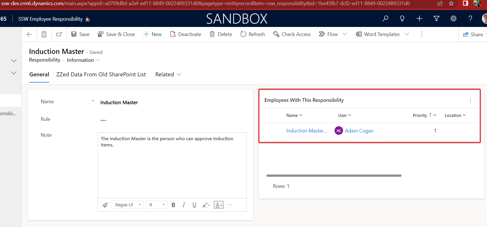

In small companies, a single key stakeholder often approves everything, ensuring alignment with the organizational vision and strategy. However, as the company grows, this can lead to bottlenecks. To address this, one strategy is to create an employee responsibility, which lists the people responsible for a specific approval. This list creates a clearly communicated system for [cross-authorization](https://www.ssw.com.au/rules/purchase-please/#cross-authorization).

<!--endintro-->

## Benefits of streamlining approvals
✅ Significant time savings for the person causing the bottlenecks (aka the "original approver")

✅ Fewer bottlenecks for those seeking approval

✅ Consistent and high-quality approvals

## Assigning employee responsibilities
1. Identify areas where you have "approval hell" aka bottlenecks
   e.g. delays in approval for induction completion.
2. Once identified, compile a list of subject matter experts who will be responsible for that approval.
3. On the list assign each person a priority, with the "original approver" having the lowest priority to minimize their involvement.
4. Induct each person by having them shadow the "original approver" for at least 3 approval processes, ensuring they understand the goal.
5. Document the list in a central repository, naming it {{ APPROVAL }} Masters. These individuals are now responsible for that approval.
e.g. the Induction Masters are responsible for induction approval.
6. Update the standard so that instead of contacting the "original approver", individuals contact the list in order until they reach any 2 of the {{ APPROVAL }} Masters. If they get approval from 2 approval masters, they are good to go!
Note: The requirement for two approvals instills confidence in the process for the "original approver".

Tip: if you think the approval may be controversial, it's a good idea to add in the "original approver", so they don't get a rude shock.

::: bad  
  
:::

::: good  
  
:::

## Communicating the streamlined approvals process
This process should ideally be implemented across all business bottlenecks. However, identifying the most problematic approvals can be challenging. 

To solve this, communicate the new approval process company-wide, encouraging employees to suggest areas for implementation. This crowdsourcing approach should yield valuable feedback on where to apply the streamlined approval process.

