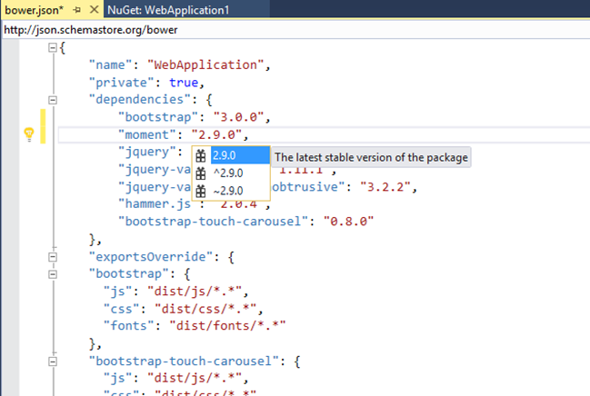
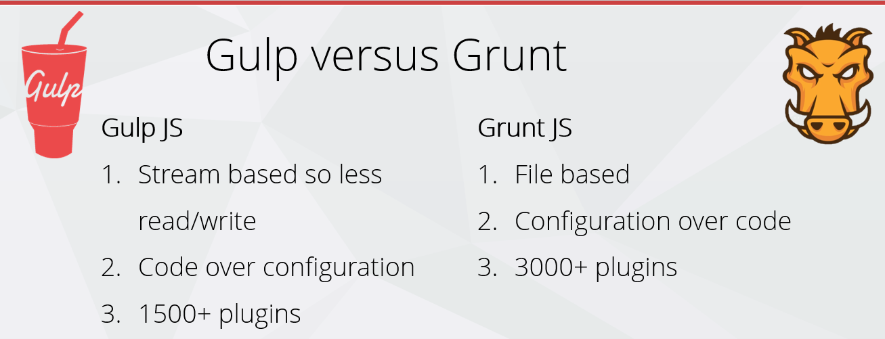
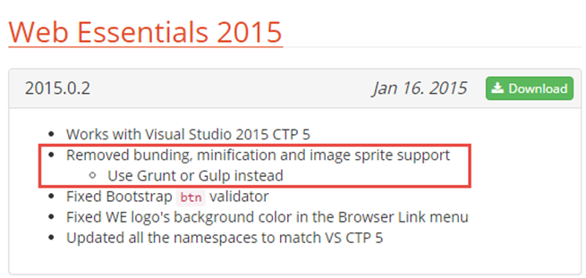

The current trend in web development is to use a large range of front-end libraries to give a great user experience.

However, .NET devs know it is no easy task to manage all of these on top of a large script folder. Previously we tried to improve and streamline the process by using NuGet, but found this package manager was ill-suited.

Another issue was that due to the requirement of checking the library’s files into source control, this has the potential to grind fellow devs to a halt while Visual Studio tries to make sense of the myriad of small JavaScript files. Furthermore, there were many smaller tasks that needed to be completed, such as minification and bundling. In the older versions of Visual Studio, a large portion of these tasks had be performed manually by the developer.

<!--endintro-->

Needless to say, however a developer could try to tackle this task, it was always a challenging and time consuming endeavour.

Enter Visual Studio 2015 with NPM (Node Package Manager) in-built. This package manager has been built from the ground up to make downloading your JavaScript libraries simple. These tools existed outside of the .NET space, but in 2015 they’ve been brought into the fold and made easy to use in Visual Studio 2015.

With NPM, we specify the name of the package and the version number we want to use, and the tool does all of the hard work finding and downloading the library. Because NPM is run on each developer’s machine, libraries are no longer added to source control. Rather, they are quickly downloaded from the trusted NPM CDN.



Working in tandem with NPM are task runners, which are JavaScript tools that can be used to add automation to your project by having them perform simple yet tedious tasks that are required to get your libraries ready for use, such as compilation, linting, and minification. Just use NPM to install the task runner of your choice, and away you go.

There are a heap of different task runners out there, the two best known are Gulp and Grunt.



For example, we could previously use web essentials to do a lot of the necessary bundling and automation, but this was killed off at the start of 2015.



This key feature was removed, but with the addition of tasks runners to Visual studio 2015 we can reimplement the functionality, by using ether Gulp or Grunt. For a number of reasons, Gulp is the better choice over Grunt: seen below is an example of a task for Gulp that will compile `.less` to `.css`.

``` js
var gulp = require('gulp');
var less = require('gulp-less');
var path = require('path');
var plumber = require('gulp-plumber');
gulp.task('less', function () {
    return gulp.src('./Content/**/*.less')
    .pipe(plumber())
      .pipe(less({
          paths: [path.join(__dirname, 'less', 'includes')]
      }))
      .pipe(gulp.dest('./content/'));
});
```

**Source:** [Gulp 101 - Getting LESS Up and Running in Visual Studio 2015](http://blog.chrisbriggsy.com/Gulp-101-CSS-all-the-LESS/ "Glup 101 in Visual Studio 2015!")
