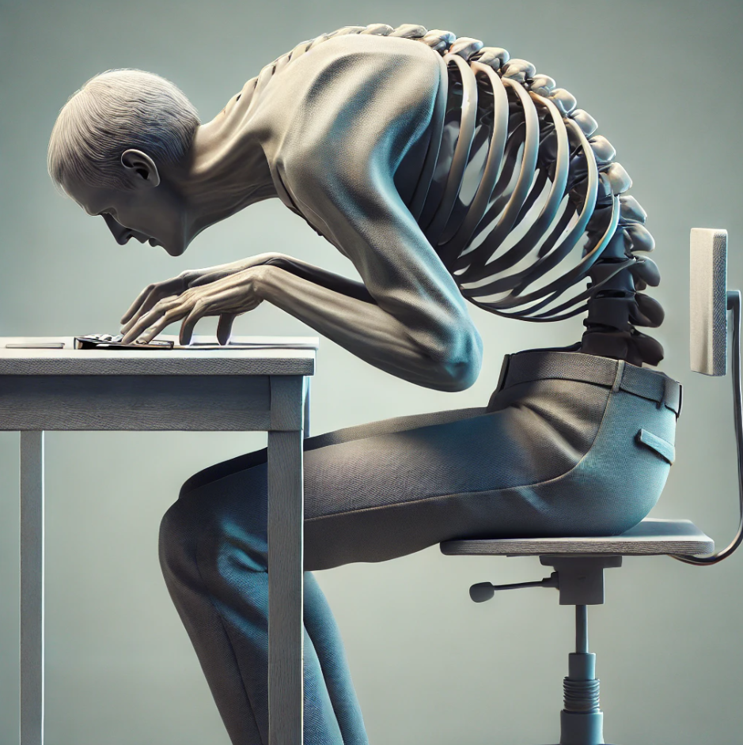
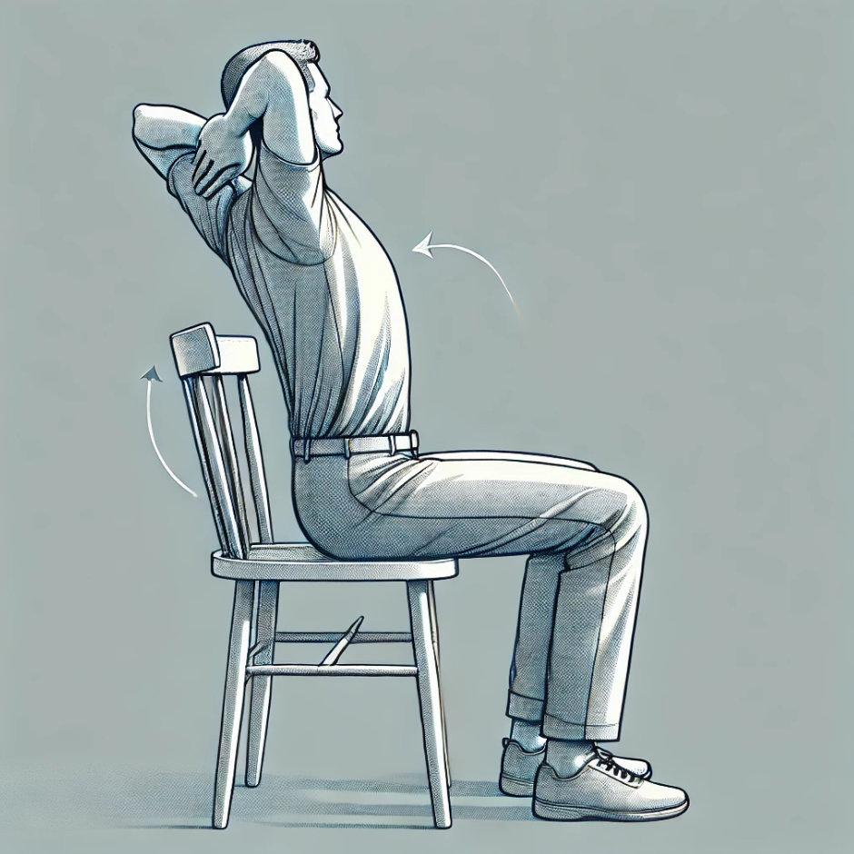

What do devs, designers, accountants and managers all have in common: they spend a lot of time at a desk - sometimes up to 8 hours a day!  

Sitting for extended periods can lead to chronic pain and tightness in key areas of the body: the hip flexors, chest, and back. These muscle groups become tight and imbalanced, leading to discomfort, poor posture, and potential long-term injuries.  

<!--endintro-->

`youtube: https://www.youtube.com/embed/IjsXSMOAMCA`
**Video: Do you know to stretch when working at a desk? | Jeoffrey Fischer | Rules (5 min)**

## The pain points  

Here are the common pain points that arise from sitting for long periods, affecting key muscle groups and leading to discomfort and potential long-term issues:

* **Back** - The back muscles become weak and strained from slouching, placing stress on the spine and leading to pain and stiffness
* **Chest** - Sitting hunched over a desk causes the chest muscles to tighten, contributing to poor shoulder posture and restricting breathing
* **Hip flexors** - Prolonged sitting keeps the hip flexors in a shortened position, leading to tightness and reduced mobility, which can cause lower back pain and hip discomfort

::: bad img-medium
  
:::

## The solution: stretches to relieve tension

Here are detailed stretches to target each of these areas:  

### 1. Back - Thoracic spine stretch

**✅ Benefits:** This stretch opens up the chest and shoulders, improving posture and relieving tightness caused by slouching forward.

1. Stand or sit up straight with your feet shoulder-width apart
2. Interlace your fingers behind your neck and bring your elbows parallel and pointing forward
3. While keeping your core engaged, slowly bend backward from your upper back, gently pushing your chest out and lifting your gaze toward the ceiling
4. Hold the stretch for 15-20 seconds and repeat as needed

::: good img-medium

:::  

### 2. Chest - Chest opener stretch

**✅ Benefits:** This stretch relieves tension in both the chest and back, helping to correct rounded shoulders and ease back strain.  

1. Stand or sit with a straight spine
2. Interlace your fingers behind your back and straighten your arms, pulling your hands away from your lower back as far as comfortably possible
3. Lift your chest upward and push your shoulder blades together, feeling a stretch across your chest and upper back
4. Hold for 20-30 seconds, and repeat a couple of times

::: good img-medium

:::  

### 3. Hips - Hip flexor stretch

**✅ Benefits:** This stretch lengthens the hip flexors, helping to counteract the tightness caused by sitting.

1. Start by standing with your feet together. Take a big step forward with your right leg and lower your body into a lunge position, with your left knee touching or hovering above the ground
2. Make sure your right knee is at a 90-degree angle and directly above your ankle
3. Shift your weight forward into your hips, feeling a stretch along the front of your left hip and thigh (hip flexors)
4. Hold this position for 20-30 seconds, then switch sides  

::: good img-medium

:::  

## Long-term solution: exercise

While stretching helps to alleviate tightness, regular exercise is key to maintaining a healthy body and preventing chronic issues. Aim for:  

* **Frequency** - Exercise at least 3-4 times per week
* **Intensity** - Focus on moderate-intensity workouts, such as brisk walking, cycling, or strength training. You should feel your heart rate increase and sweat, but still be able to hold a conversation
* **Duration** - Each session should last 30-60 minutes, balancing cardio for heart health and strength training to improve muscle tone and posture

This combination of stretching and exercise will help you combat the negative effects of prolonged sitting, ensuring better posture, flexibility, and overall well-being.
