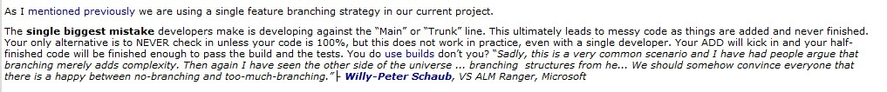
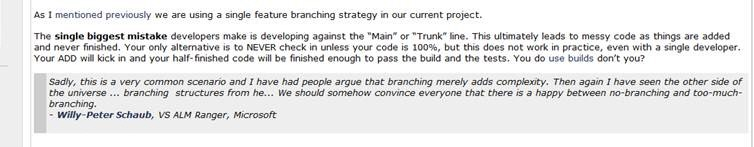

When you add a quotation, put them in a new line with an indent.

<!--endintro-->

::: greybox
Software development can be painful and costly. Hang on, that should say "Software development **is** painful and costly."  
:::
::: bad
Figure: Bad example - The quotation without a new line (or indent)  
:::

::: greybox
Software development can be painful and costly. Hang on, that should say:   
&nbsp;&nbsp;&nbsp;"Software development **is** painful and costly."  
:::
::: good
Figure: Good example - The quotation on a new line and indenting  
:::

You should always indent any quotes that you use on a new line.

::: bad

:::

::: good

:::
