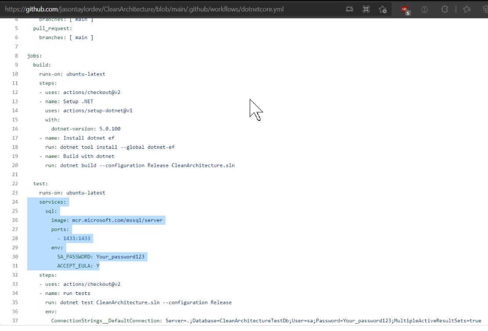
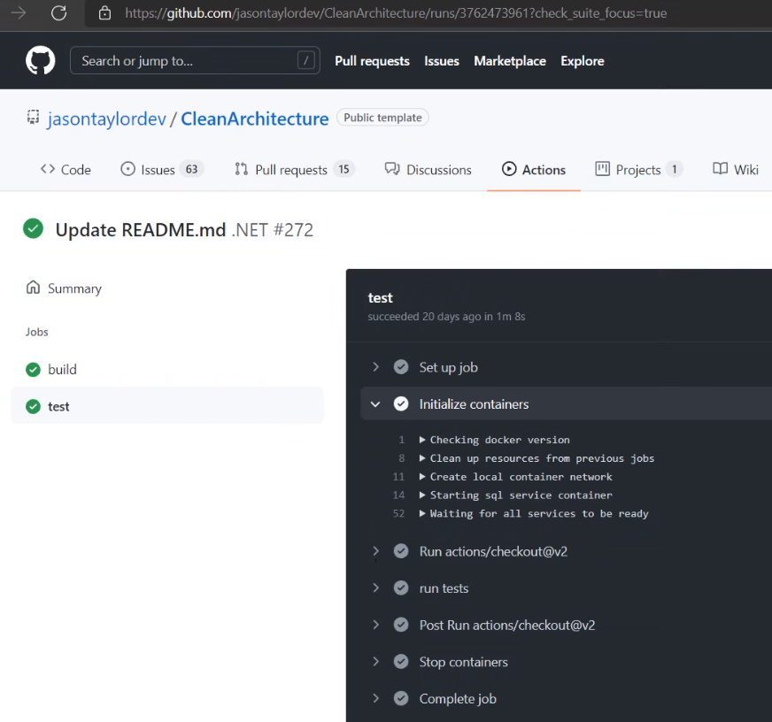

Automated-UI testing tools like [Playwright](https://playwright.dev/) and [Selenium](https://www.selenium.dev/) are great tools for testing the real experience of the users. Unfortunately, sometimes these tests can feel a bit too fragile. When that happens, Subcutaneous just beneath the skin tests look to solve this pain point by doing integration testing just below the UI.

<!--endintro-->

Martin Fowler was one of the first people to [introduce the concept of Subcutaneous tests](https://martinfowler.com/bliki/SubcutaneousTest.html) into the mainstream. Subcutaneous tests are great for solving problems where automated-UI tests struggle to manipulate the UI in the right way.

They are:

* Written by developers
* Test the full underlying behaviour of your app but bypasses the UI
* Requires business logic to be implemented in the API / middle layer and not in the UI.
* Tests can be much easier to write than using technologies that drive a UI

  e.g. Playwright or Selenium

### Integrate with DevOps

The gold standard is to automate the testing of subcutaneous tests by incorporating them into your DevOps processes such as when you perform a Pull Request or a build. You can do this using GitHub Actions or Azure DevOps.

::: good

:::

::: good

:::

Jason Taylor has a fantastic example of Subcutaneous testing in his [Clean Architecture template](https://github.com/jasontaylordev/CleanArchitecture/tree/main/tests/Application.IntegrationTests)