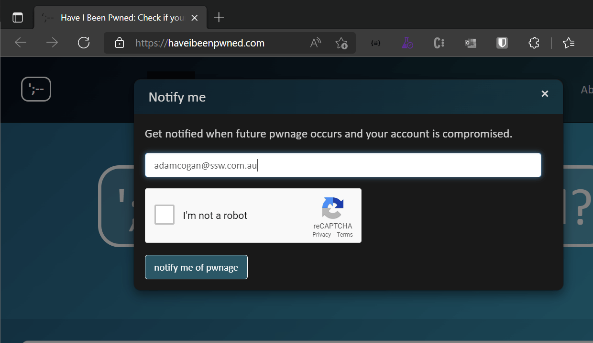

Sometimes passwords can be compromised through no fault of our own. There have been several high-profile breaches of password databases.

<https://haveibeenpwned.com> is a free database that aggregates data from breaches, and you can use it to check whether your account has been included in a known breach.

<!--endintro-->

You can enter your username (usually an email address) and it will tell you if your email address has shown up in a known data breach. If it has, that password is compromised and should be changed immediately.

You can also subscribe to Haveibeenpwned, so that if in the future your email address shows up in a breach, you can be notified straight away.

