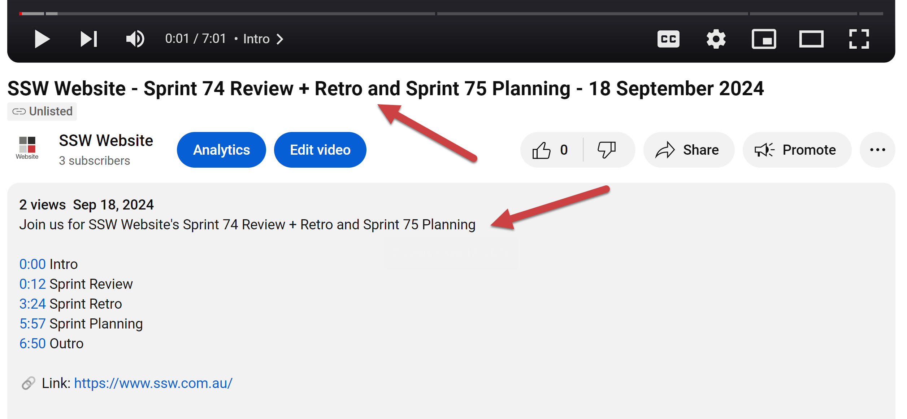

Creating a comprehensive summary and recording of your Sprint Meeting is a great way to communicate changes in a product to the community and stakeholders — especially for those unable to attend.

<!--endintro-->

## Why record a summary of the Sprint Meeting?

* **Clarity:** Provides a clear, accessible update for all stakeholders, including those not present.
* **Documentation:** Serves as a historical record of decisions and discussions, valuable for future Sprints and project continuity.
* **Engagement:** Ensures that all stakeholders, regardless of their availability to attend, have access to the same information, promoting inclusiveness and alignment.
* **Community:** Allows the community at large to see what is happening on a product and provide feedback.

## Record the Sprint Meeting summary

The Sprint Meeting summary should be what it is: a summary. So keep it concise by focusing on the main goals and decisions that were discussed during the Sprint Meeting.

Here's a suggested runsheet for what to cover in the video:

1. Before the recording, inform participants that the session is being recorded and ask them if there's nothing sensitive in the Sprint Retrospective
2. Start the recording by showing the Product website
3. Run through Sprint Review Email - which should include the Sprint Retrospective
4. Run through Sprint Planning Email
5. Finish the recording on the Product YouTube Channel, and mention that the current recording will be uploaded there

If you're looking for useful tips on how to make great videos, please see this rule: [Do you know the key things for making a great 'Done Video'?](https://www.ssw.com.au/rules/making-a-great-done-video)

If you need to make edits on your recording, please see this rule: [Do you know how to record a quick and dirty 'Done Video'?](https://www.ssw.com.au/rules/record-a-quick-and-dirty-done-video/)

## Share the Sprint Meeting summary recording

If you've never uploaded a video to YouTube, you can follow [this tutorial](https://support.google.com/youtube/answer/57407?sjid=14705773004983041204-AP)

Note: Don't forget to check that you're uploading to the right channel. We recommend having a channel for each product. E.g. [SSW Website](https://www.youtube.com/channel/UCi7s9fJp6RlvHCMK2hATK7g), [SSW TimePro](https://www.youtube.com/channel/UCKf-M2C0b3_ca4kwzmvmERg), etc.

During the process, you will need to provide some information such as a title, description and thumbnail.

#### Video Title

It is important to have an accurate title that makes it clear what Scrum Sprint you are making a video for. The best way is to follow a consistent format across each video.
At SSW, we follow this format:

::: greybox
{{ TEAM NAME }} - Sprint {{ OLD NUMBER }} Review + Retro and Sprint {{ NEW NUMBER }} Planning - {{ DATE }}  
:::

#### Video Description

You should also include a description about the contents for ease of navigation. E.g. YouTube allows you to add timecode chapter markers by adding it in the description.

::: greybox
Join us for {{ TEAM NAME }}'s Sprint {{ OLD NUMBER }} Review + Retro and Sprint {{ NEW NUMBER }} Planning

{{ MIN }}:{{ SEC }} Intro  
{{ MIN }}:{{ SEC }} Sprint Review  
{{ MIN }}:{{ SEC }} Sprint Retro  
{{ MIN }}:{{ SEC }} Sprint Planning  
{{ MIN }}:{{ SEC }} Outro  

🔗 Link: {{ PRODUCT WEBSITE URL }}
:::

#### Video Thumbnail

The thumbnail should show the Sprint iteration, the Team's name and the date when the meeting occured. Thus, it needs to be easily editable. For instance, the Website Team uses a PowerPoint slide that they update every week: [SSW Website Thumbnail](https://sswcom.sharepoint.com/:p:/s/SSWWebsitev3/EXK91BgLmO9DnT9np2HabPoBm5vQiKfggtG3DqtDw-aQHA?e=Im08L9)

Below is a good example of how the title and description should look like on YouTube.

::: good

:::

::: greybox
Don't let the time you spent creating the perfect video go to waste — make sure people actually watch it! For those required to view the video, send them the following task:

  1. Watch the video: {{ YOUTUBE URL }}
  2. Rate it out of 10
  3. Leave a brief comment on YouTube
:::

#### ✅ Good Example of a Sprint Meeting recording

Here is an example of a Sprint Meeting recording from the [Tina CMS](https://tina.io/) Team.

`youtube: https://www.youtube.com/watch?v=t3SlxTKiT6U`
**Video: TinaCMS - Sprint 23 Review and Sprint 24 Forecast (10 min)**

By adopting these practices, teams can ensure that the outcomes of Sprint Meetings are effectively communicated and documented, supporting project success and stakeholder satisfaction.
