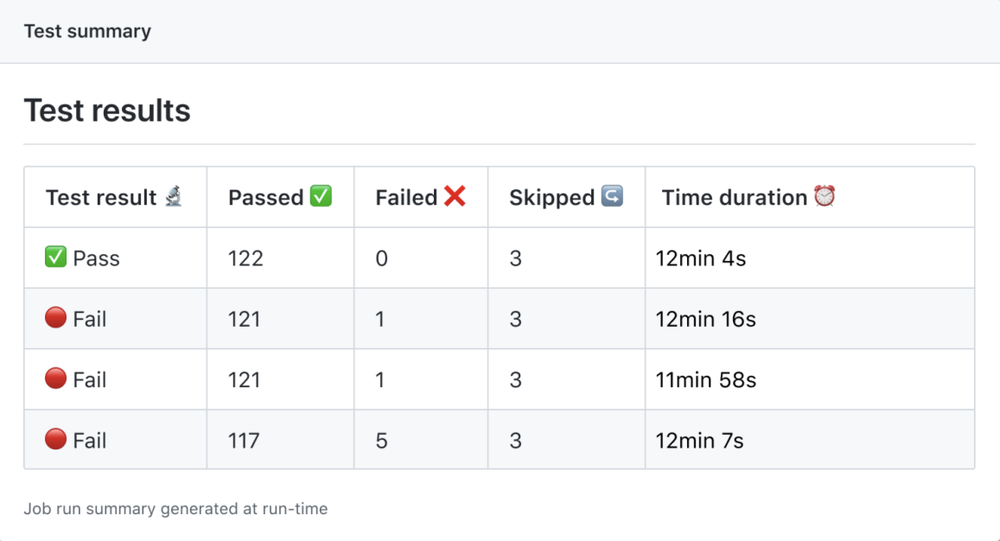
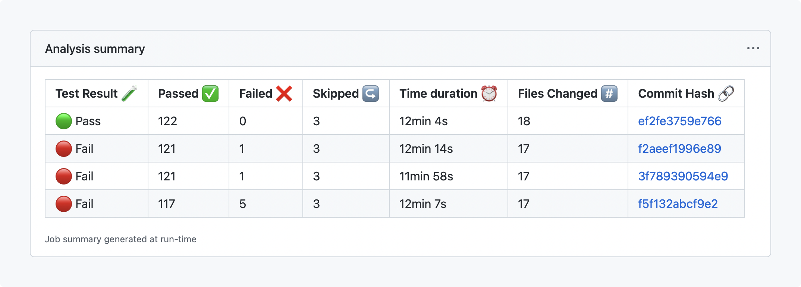
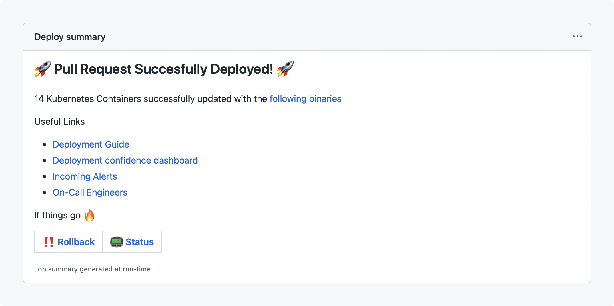

You can now output and group custom Markdown content on the Actions run summary page.

Custom Markdown content can be used for a variety of creative purposes, such as:

* Aggregating and displaying test results
* Generating reports
* Custom output independent of logs



### How to create Job Summaries

Simply output Markdown content to a new environment variable we’ve introduced called [$GITHUB_STEP_SUMMARY](https://github.blog/2022-05-09-supercharging-github-actions-with-job-summaries). Any Markdown content added to this file will then be displayed on the Actions run summary page.

```Bash
steps:
  - name: Adding markdown
    run: echo '### Hello world! :rocket:' >> $GITHUB_STEP_SUMMARY
```

### More things you can do with Markdown[](https://github.blog/2022-05-09-supercharging-github-actions-with-job-summaries/#endless-possibilities-with-the-power-of-markdown)

The same familiar functionality that powers pull requests, issues, and README files has come to Actions! Actions Job Summaries support [GitHub Flavored Markdown](https://github.github.com/gfm/), which is incredibly powerful and allows users to create amazing workflows, as well as Actions to enhance their experience.

Below, are just a few examples of what we envision users doing with Job Summaries.





