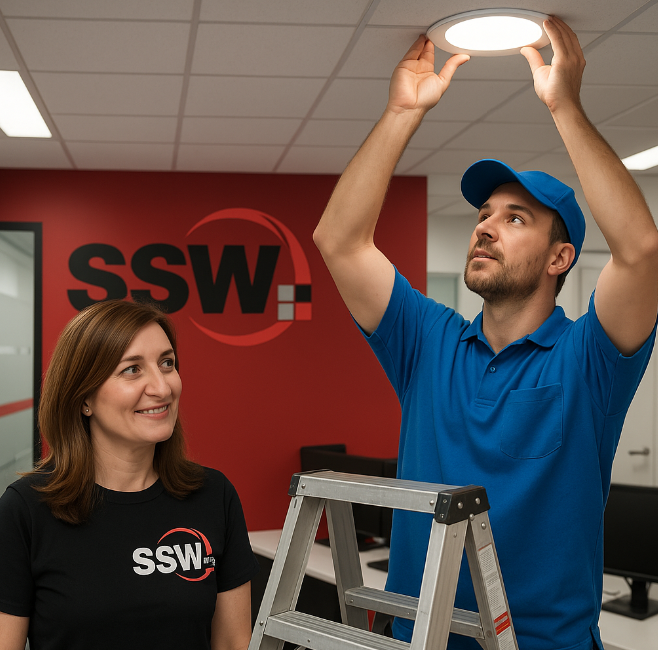
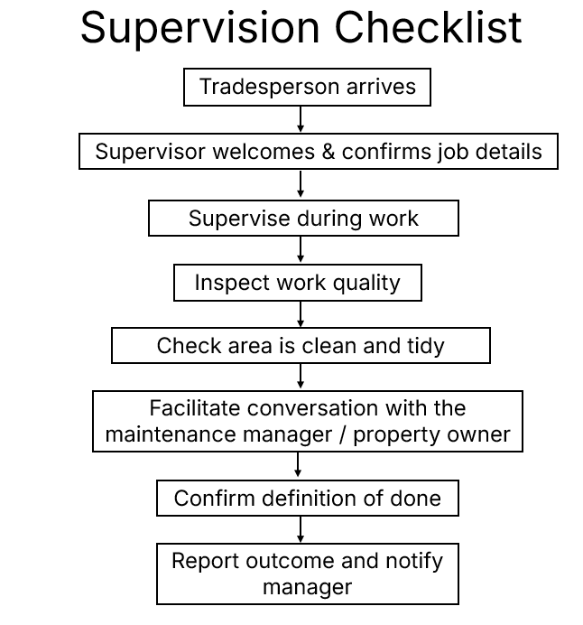

Tradespeople often carry out important maintenance or repair work in our offices and project sites. If they are left unsupervised, the result can be poor workmanship, incomplete jobs, or changes made without approval. This leads to frustration, wasted money, and extra time spent fixing mistakes.  

To prevent these issues, a person should always supervise the tradesperson, be present at their arrival and departure, facilitate a handover conversation with the Maintenance Manager or Property Owner, and then clearly report back with the outcome.  

<!--endintro-->

## Why supervision matters

* Tradespeople may not be familiar with our standards or priorities  
* They may make assumptions about what needs to be done  
* Supervision ensures the job is completed to expectations the first time  
* Consistency matters — Having the same person supervise across multiple visits avoids confusion and miscommunication

## Responsibilities of the supervising staff member

* **Be there when trades arrive** – Welcome them, confirm the job details, and set expectations  
* **Stay available during the work** – Answer questions and ensure they follow agreed instructions
* **Be there when trades leave** – Check the work is correct, ensure the area is neat and tidy, and confirm with the Maintenance Manager or property owner what “done” looks like  
* **Facilitate a final conversation** – Before the tradesperson leaves, bring in the Maintenance Manager or property owner (in person or via phone/Teams) to confirm the [Definition of Done](/definition-of-done) and sign off on the work
* **Confirm continuity** – Where possible, the same SSW person should supervise all visits by the same tradesperson
* **Notify the Maintenance/Property Manager** – If they are not on site, send a quick message when trades arrive and again when they leave
* **Communicate results** – Report what was completed, any issues, and if follow-up is required. Photos, videos and video calls are encouraged

::: greybox
“The plumber came in today.”  
:::
::: bad
Figure: Bad example – Too vague, no confirmation of quality, tidiness, or completeness
:::

::: greybox
“The electrician replaced the faulty light in the Level 3 meeting room. I supervised the work, confirmed it was functional, and ensured the space was tidy.
Before the electrician left, I had a quick call with the Maintenance Manager to confirm the job met the Definition of Done. Photos sent for record.”  
:::
::: good
Figure: Good example – Supervised, tidy outcome, and Definition of Done confirmed with Maintenance Manager
:::

## Supervision checklist workflow

