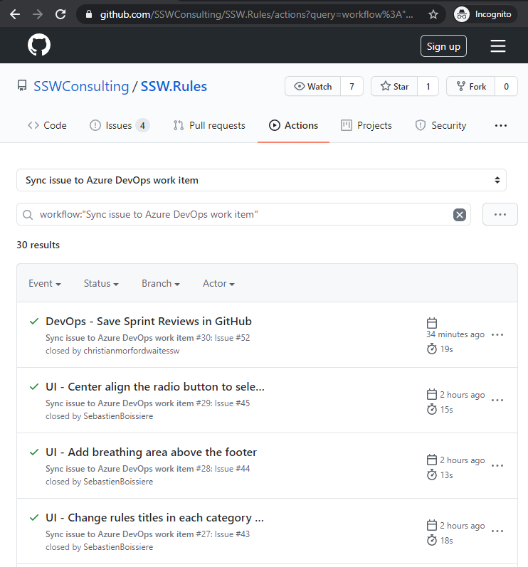

​​If you store all your code in GitHub, why not create all your issues there too?
 You might be reluctant to move your backlog to GitHub from Azure DevOps as you don’t want to lose the metrics functionality. 

But you can easily sync all your GitHub Issues to Azure DevOps automatically to have the best of both worlds. 

 <excerpt class='endintro'></excerpt> 

Here's a quick guide in setting it up for your GitHub Repository and Azure DevOps.​ 

1. Install the <a href="https://github.com/marketplace/azure-boards">Azure Boards App</a> from the GitHub Marketplace 2. Create the GitHub Action secrets​ 
<blockquote style="margin:0px 0px 0px 40px;border:none;padding:0px;"><ul><li><strong>​​ADO_PERSONAL_ACCESS_TOKEN </strong>(Azure DevOps | User settings | Security | Personal access tokens) The <a href="https://docs.microsoft.com/en-us/azure/devops/organizations/accounts/use-personal-access-tokens-to-authenticate">Azure Personal Access Token</a> requires "read & write" permission for Work Items. </li><li><strong>GH_PERSONAL_ACCESS_TOKEN </strong>(GitHub | Personal settings | Developer settings | Personal access tokens) The <a href="https://help.github.com/en/enterprise/2.17/user/github/authenticating-to-github/creating-a-personal-access-token-for-the-command-line">GitHub Personal Access Token​</a> requires "repo" permissions. </li><li><strong>ADO_ORGANIZATION </strong>(https://<strong>ssw</strong>.visualstudio.com/SSW.Rules) The Organization name is in your Azure DevOps URL. </li><li><strong>ADO_PROJECT </strong>(https://ssw.visualstudio.com/<strong>SSW.Rules</strong>)​ ​The Project name can also be found in your Azure DevOps URL. </li></ul></blockquote>
3. Create the following GitHub Action​ 

e.g.​ SSW uses this template for their projects, you may need to change the new and closed states depending on your environment. 

​​​name: Sync issue to Azure DevOps work item on:   issues:     types:       [opened, edited, deleted, closed, reopened, labeled, unlabeled, assigned]  jobs:   alert:     runs-on: ubuntu-latest     steps:       - uses: danhellem/github-actions-issue-to-work-item@master         env:           ado_token: "${{ secrets.ADO_PERSONAL_ACCESS_TOKEN }}"           github_token: "${{ secrets.GH_PERSONAL_ACCESS_TOKEN }}"           ado_organization: "${{ secrets.ADO_ORGANIZATION }}"           ado_project: "${{ secrets.ADO_PROJECT }}"           ado_wit: "Product Backlog Item"           ado_new_state: "New"           ado_close_state: "Done"           ado_bypassrules: true  
<dd class="ssw15-rteElement-FigureGood">Figure: Good Example - GitHub Action​​ to Sync Issues to Azure DevOps </dd><dl class="ssw15-rteElement-ImageArea"> <dd class="ssw15-rteElement-FigureGood">​Figure: Good Example - GitHub Issues Syncing to Azure DevOps ​ </dd></dl>
​Pros​
<ul><li>​Easily manage sprints and calculate burndown and cycle time </li><li>See all your GitHub Issues and Azure DevOps PBIs in one backlog </li><li>Automated tagging and hyperlinking between Issues and PBIs​ </li></ul><h3 class="ssw15-rteElement-H3">Cons </h3><ul><li>The sync is only one-way GitHub Issues -&gt; Azure DevOps Backlog </li><li>​It won’t sync existing GitHub Issues unless they are updated </li></ul>  More information about this GitHub Action can be found here <a href="https://github.com/danhellem/github-actions-issue-to-work-item">https://github.com/danhellem/github-actions-issue-to-work-item</a>  

