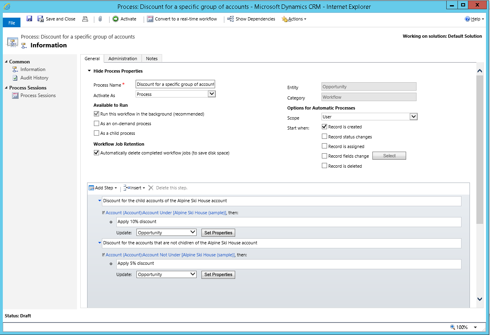
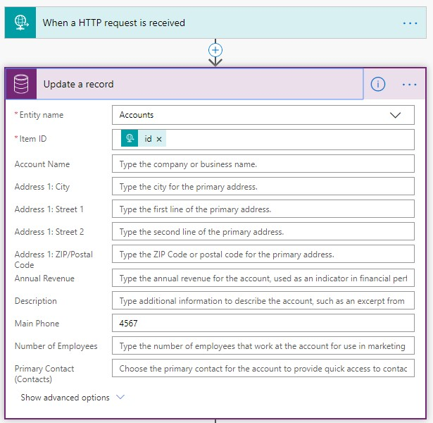

Dynamics has come a long way since the early days and now sits under Power Platform. So why not take advantage of all the capabilities to make Dynamics sing. Prior to Power Automate and Azure Functions, a Dynamics developer would use a combination of Workflows (synchronous and asynchronous) and Plugins to extend the system.

<!--endintro-->

### Power Automate

While there is are still some limited scenarios for using Workflows (Power Automate doesn't yet support synchronous execution) and Plugins (again synchronous support), Microsoft is shepherding developers toward Microsoft Flow (Power Automate) for automation tasks, and this is a great thing.

Case for Power Automate instead of regular Dynamics workflows:

* A massive number of [connectors](https://make.powerautomate.com/connectors) from Act! to Zendesk and everything in between
* Can't find the connector you need? No problem, create a [Custom Connector](https://docs.microsoft.com/en-us/connectors/custom-connectors/define-blank) or just use a generic HTTP request
* Intuitive debugging experience, see errors immediately, fix and re-run failed flow
* Visually much nicer UI compared to Dynamics Workflow experience

The case against Power Automate instead of regular Dynamics workflows:

* No real-time workflow support, so if real-time workflows are needed then Dynamics workflows are the only solution for now

### Azure Functions

Previously when there was a more complex operation that needed to happen, for example, a complex scoring requirement for customer sentiment this logic would be contained in a plugin. Most Dynamics developers avoid writing plugins as they're a huge time sink, difficult to debug, and just not cool. The cool kids write the complex logic in Azure Functions.

The case for Azure Functions instead for Dynamics plugins:

* The developer requires zero Dynamics experience to implement an Azure Function (useful to have Dynamics experience but it's not an impediment)
* An Azure Function is a WebAPI endpoint and can be called by other applications
* Very smooth debugging experience
* Application Insights built-in
* The Dynamics layer can be abstracted away, Azure Function can implement the logic only
* Power Automate can sit in the middle of Dynamics and the Azure Function as the glue layer

The case against Azure Function instead of regular Dynamics Plugins:

* Plugins can register against many Pre and Post events whereas an Azure Function is a WebAPI endpoint
* Azure Functions are a [paid](https://azure.microsoft.com/en-au/pricing/calculator/) Azure service, while extremely cost-effective, it is still an additional cost

  

