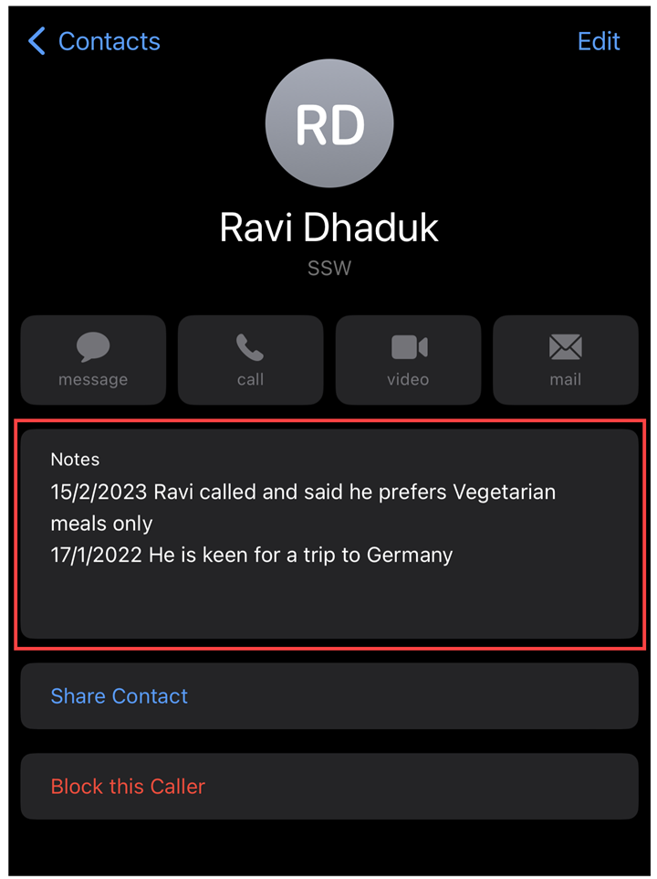

Taking effective notes is an important skill that can help you stay organized and remember important information. Whether you’re in a meeting with a client or jotting down tasks for your to-do list, it’s important to have a system in place for taking and organizing your notes.

One key tip for taking effective notes is to avoid deleting old notes. It may be tempting to delete notes once they’re no longer relevant, but it’s often better to archive them or move them to a different location where they can still be accessed if needed. This way, you won’t regret deleting valuable information later on. However, moving it to a different place may make it hard to find.

An even better way to take notes is to include metadata such as the date and time when the note was taken, as well as your name. This can help you keep track of when and by whom the note was taken, making it easier to find and reference specific notes later on.

Here are a few examples of how this can be done:

### Example 1 - On an Invoice page with a notes field
  
::: good

:::

### Example 2 - On your phone contacts

::: good

:::

By following these tips and developing a system that works for you, you can take more effective notes that will help you stay organized and remember important information.
