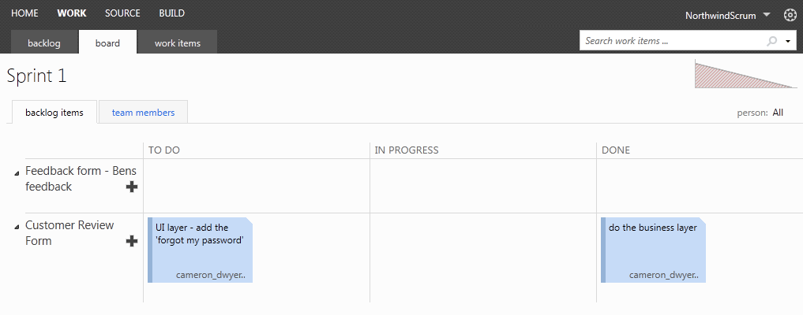

Having an electronic task board makes it easy for developers to keep track of tasks.

These are the 3 columns (aka swim lanes) you need:

<!--endintro-->

* To do
* In progress
* Done

::: good  
  
:::

Physical is OK too for small, co-located teams.

::: ok  
  
:::

Near your task board, stick an SSW "Want to submit a User Story?"

* Where to find their project portal
* Who to contact with questions
* How to add tasks to the task board

[Print out this PDF](https://github.com/SSWConsulting/SSW.Rules.Content/raw/main/rules/the-war-room-does-your-development-room-have-an-electronic-task-board-physical-is-ok-too-for-small-co-located-teams/SSWSubmitaPBI.pdf) and fill in the 2 fields and stick it on own task board.

