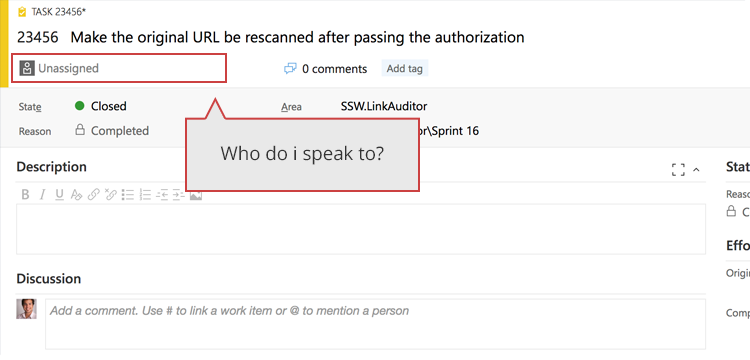
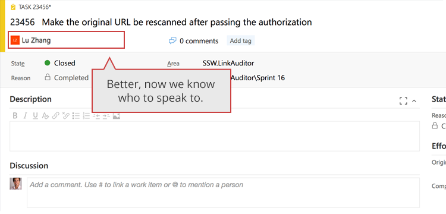
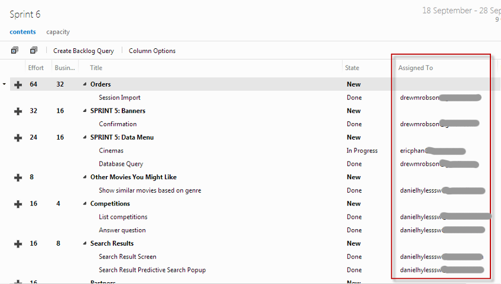

When you are building complicated software and working with customers it is always nice for them to have some idea on who to speak to about a particular PBI during a sprint. In order to achieve this one of the Team takes responsibility for “looking after” a PBI. They will collect all of the<a href="/_layouts/15/FIXUPREDIRECT.ASPX?WebId=3dfc0e07-e23a-4cbb-aac2-e778b71166a2&TermSetId=07da3ddf-0924-4cd2-a6d4-a4809ae20160&TermId=29d5ca5d-c191-475f-8db2-0086c44ca46c" target="_blank" shape="rect">“Done” emails</a> and make sure that everyone follows the Done criteria identified by the team as well as answering any Product Owner queries. 

 <excerpt class='endintro'></excerpt> 

During a sprint it can be useful for:
<ul><li>The Product Owner to know who to speak to regarding a PBI </li><li>The Team to know who will be presenting the PBI at the Sprint Review</li></ul>
In order to achieve this, one of the Team can choose to be the primary contact for the PBI. 

Beware, this is intended for convenience and should not conflict with the following Scrum principal​s from page 6 of the <a href="/Pages/Scrumguide.aspx">Scrum Guide</a>
<ul><li>The Development team is self-organizing.</li><li>Accountability belongs to the development team as a whole ​ </li></ul><dl class="badImage"><dt> 
      
   </dt><dd>Figure: Bad example - The Product Owner is not sure who to speak to</dd></dl>
<dl class="goodImage">​
   <dt> 
      
   </dt><dd>Figure: Good example - The Product Owner can now see who he should speak to and developers know where to send done emails</dd></dl><dl class="image"><dt> 
       
   </dt><dd>Figure: Use the 'Assigned To' column to identify who will be presenting the task​   </dd></dl>

