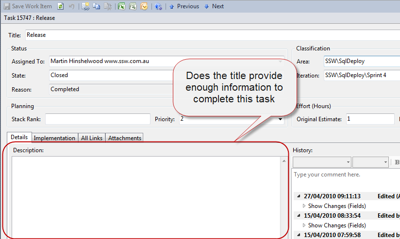
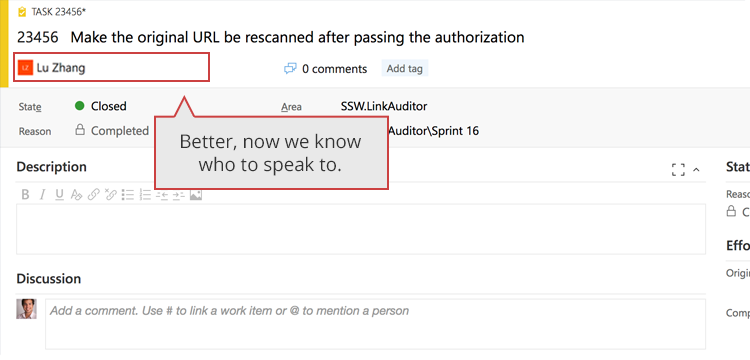

  
When you create tasks in Scrum you are doing this within a time box and you tend to add only the information you need to remember what the task is. And the entire Team was at the meeting and were involved in the discussions around the task, so why do you need more? 
 

 <excerpt class='endintro'></excerpt> 

Once you have accepted a task you should then add as much information as possible so that anyone can pick up that task; what if your numbers come up? Will you be into work the next day?
<dl class="image"><dt>  </dt><dd>Figure: What if your numbers come up in the lottery?</dd></dl>
What if the Team runs a syndicate and all your numbers come up? The point is that anything can happen and you need to protect the integrity of the project, the company,​ and the Customer.

Add as much information to the task as you think is necessary for anyone to work on the task.

If you need to add rich text and images you can do this by <a href="/Pages/EnsureRelevantEmails.aspx" target="_blank">attaching an email to the task</a>. ​ 
<dl class="badImage"><dt>  </dt><dd>Figure: Bad example, there is not enough information for a non team member to complete this task</dd></dl><dl class="image"><dt>  </dt><dd>Figure: Julie provided a lot more information and another team should be able to pick this up</dd></dl>
 <b>Note:</b> If you are updating the details of a PBI then follow the rule “<a href=/when-you-use-mentions-in-a-pbi>Do you know when you use @ mentions in a PBI?​</a>”  

