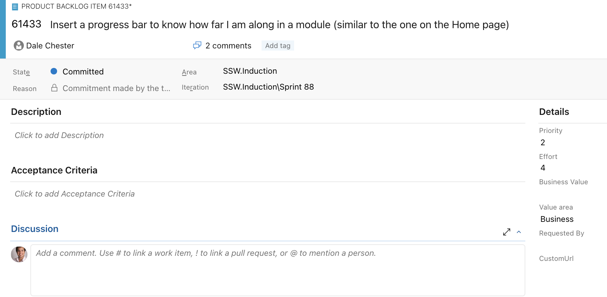
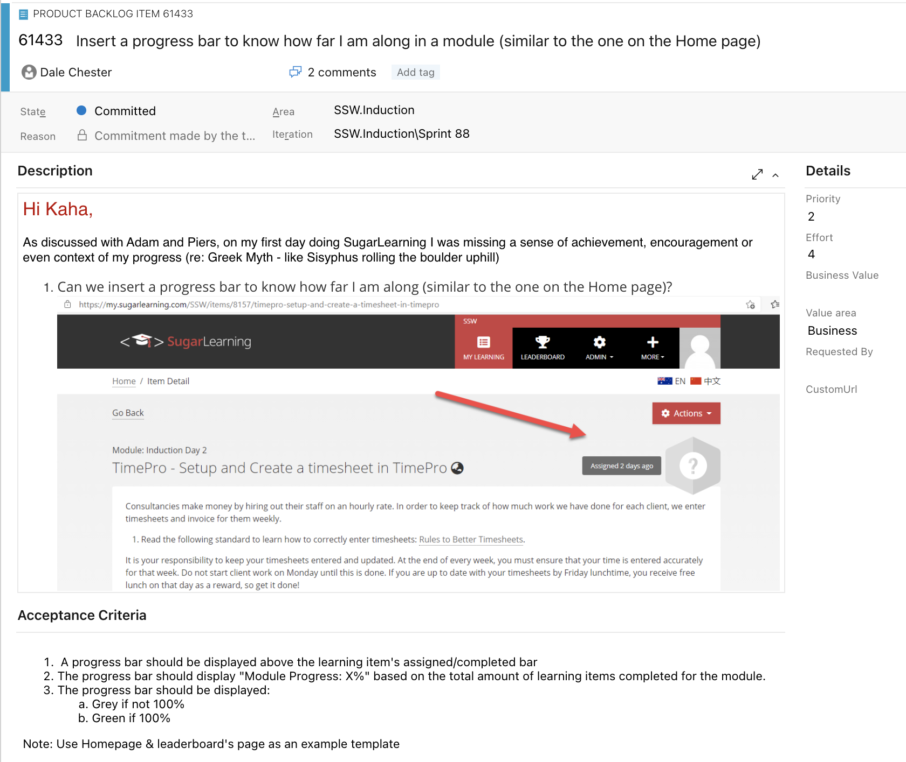

When you create tasks in Scrum you are doing this within a time box and you tend to add only the information you need to remember what the task is. And the entire Team was at the meeting and were involved in the discussions around the task, so why do you need more?

<!--endintro-->

Once you have accepted a task you should then add as much information as possible so that anyone can work on that task.

You can use rich text and images to be extra clear, or even [attach an email to the task](/tasks-do-you-know-to-ensure-that-relevant-emails-are-attached-to-tasks).

::: bad

:::

::: good

:::

**Note:** If you are updating the details of a PBI then follow the rule “[Do you know when you use @ mentions in a PBI?](/when-you-use-mentions-in-a-pbi)”