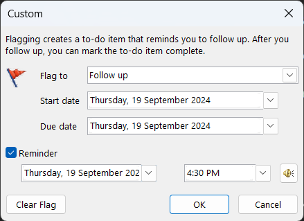
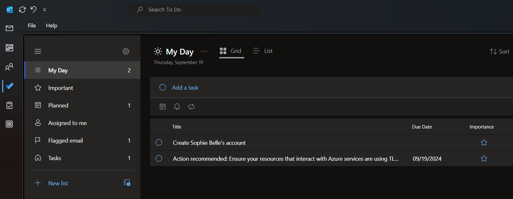

SysAdmins get through many tasks in a day. These tasks are generally prioritized based on their importance, but some tasks will have a due date - or a ticking clock ⏰. It's important to have a system in place to make sure these tasks are done on time.

Otherwise, you might not get a new starter's account created before their start date, or you might not give a dev access to a resource they need in time for an important feature launch.

Of course, this does not just apply to SysAdmins - use this rule for any teams or tasks that fall outside of [Scrum](https://www.ssw.com.au/rules/rules-to-better-scrum/).

<!--endintro-->

### Option 1: Using Outlook

Everyone receives tasks in their inbox, so it's good to know how to set a due date on your emails. Just like [following up effectively](https://www.ssw.com.au/rules/follow-up-effectively/), there are a many ways to do this - let's look at 3 ways:

#### 1. followupthen.com

followupthen.com is a simple way to get an email reminder when you need to start working on something. 

Just email {{ TIME/DATE }}@followupthen.com, and you'll get an email in your inbox when you need it. Of course, you'll need to give yourself time to complete the task before it's due!

Note: You can BCC @followupthen.com on any email with other people, and the reminder will only go to you.

::: email-template
| | |
| -------- | --- |
| To: | 1week@followupthen.com |
| Subject: | New Starter - Sophie Belle |
::: email-content  

### To Myself,

Sophie Belle starts work tomorrow.

1. Get their account set up today

Thanks!

:::\
:::  

#### 2. Follow up flags

Follow up flags are Outlook's built-in way to set a due date on an email. Add a follow up flag from the red flag icon in the ribbon, or by right-clicking on an email | Follow up. From there you can also set a custom reminder.

The only downside is that you only get a notification (not an email) - so you might miss it.

#### 3. Microsoft To Do

[Microsoft To Do](https://www.microsoft.com/en-au/microsoft-365/microsoft-to-do-list-app) is available within Outlook, as a separate app, or on the web. It's a great way to keep track of tasks, reminders and other lists. It can also integrate follow up flags from Outlook.

### Option 2: Using Zendesk

SysAdmins will mostly work out of a ticketing system like [Zendesk](https://www.ssw.com.au/rules/rules-to-better-zendesk/). Other ticketing systems likely have similar functionality to the below.
