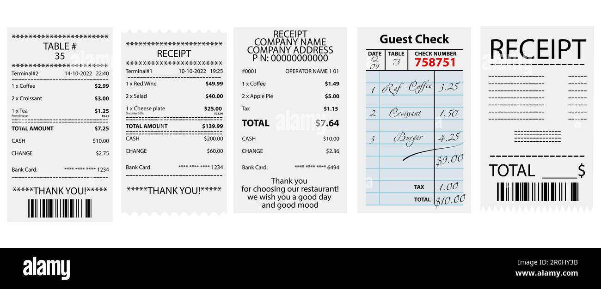

When you make purchases in-store by card, you typically receive 2 receipts - Tax Invoices and Eftpos Payment Receipts.
They might seem like two peas in a pod, but they're different creatures serving different purposes.
It is important to distinguish Tax Invoice vs. Eftpos Payment Receipt, but let's admit, it's a bit confusing for many.

### Tax Invoice

An official document issued by a seller to a buyer, detailing the products or services provided along with their respective prices.
It is a legal requirement for businesses to issue tax invoices for taxable sales.
A tax invoice would normally have the following:

Business Information

* Seller's info - name, address, and contact details.
* Buyer's info - name and address.

Invoice Details

* Invoice number.
* Date – when the invoice created.

Product/Service Information

* Description - the products or services.
* How much - Quantity, unit price, and total amount.

Tax Information

* Tax - Goods and Services Tax (GST) details.
* Total amount - including GST.

### Eftpos Payment Receipt

An Eftpos Payment Receipt is a document confirming that a payment has been made through an Electronic Funds Transfer at Point of Sale (Eftpos) system.
It acknowledges the successful completion of a transaction.
It usually shows information of:

TRANSACTION DETAILS

* When - Date and time of the transaction.
* How - Payment method and card type.

BUSINESS INFORMATION

* Who - Merchant's name and contact information.

AMOUNT INFORMATION

* How much - Total amount paid.
* Approved or declined - Confirmation of payment.

### Spot the difference

The primary purpose of a Tax Invoice is to provide a comprehensive record of a transaction for tax and accounting purposes.
While an Eftpos Payment Receipt is like a digital high-five after you've paid for something using Eftpos. It's a record saying, "Yep, the payment went through!"

Purpose

* Tax Invoice: Primarily for tax and accounting purposes.
* Eftpos Payment Receipt: Confirmation of payment.

Content

* Tax Invoice: Detailed information on products/services, taxes, and payment terms.
* Eftpos Payment Receipt: Focuses on transaction details, amount, and payment method.

Legal Requirement

* Tax Invoice: Often required by tax authorities for proper documentation.
* Eftpos Payment Receipt: Serves as a customer receipt, not always legally mandated.

For businesses, maintaining tax invoices is a must for keeping solid accounting records and claiming tax or GST.
Eftpos payment receipt is a helpful supplementary, especially when you've paid more than the invoiced amount (cue credit card charges).
However, it's essential to note that while the Eftpos receipt confirms payment, it can't replace the role of a tax invoice.
The invoice is the official record that details why and where you spent that money, making it irreplaceable for comprehensive documentation.

If you're not sure which papers you need, just keep everything. It's way better to have too many records than miss out on something important.
