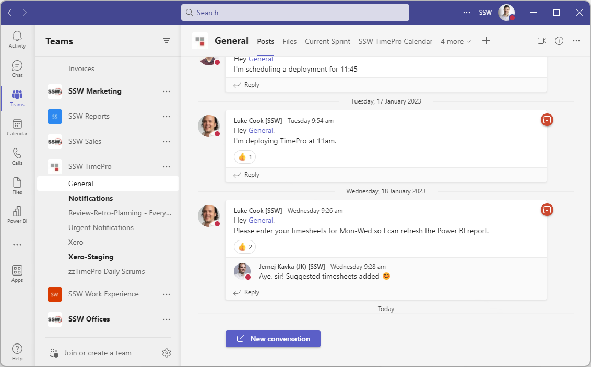
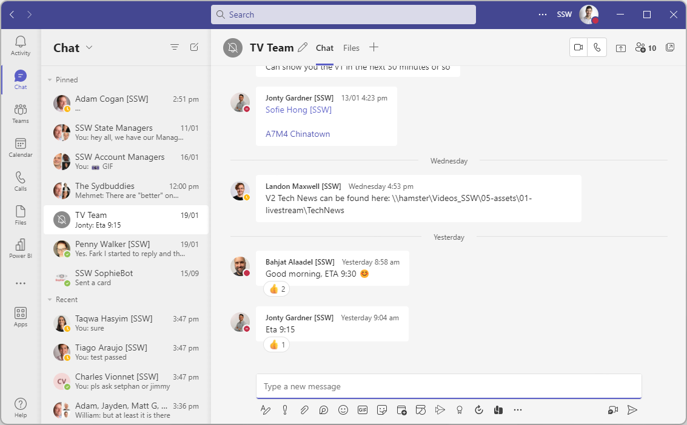

Teams is a powerful way to chat, collaborate, and video call with your project team. As soon as you start a new project, create a group chat with all the team members (potentially including the client if appropriate).

Although you will also have a dedicated Team (as per [SSW.Rules | Do you know how to create a Team?](/create-a-team)), which is great for storing documents and files, as well as persisting notifications, you’re better to communicate in a chat rather than a channel since:  
✅ You will be actively notified of new messages
✅ The conversation flows more naturally (rather than threaded)  
✅ You can quickly call the whole team into a video call  

The cons are:  
❌ People cannot add themselves to a chat so will need someone on the team to add them  
❌ In larger teams, the lack of conversation threading may become an issue  

::: bad

:::

::: good

:::
