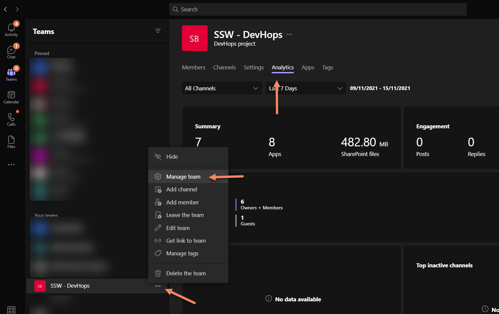
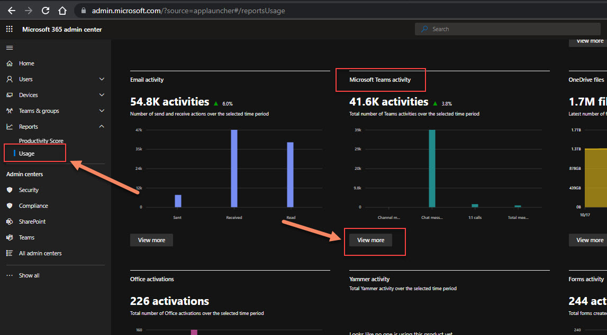
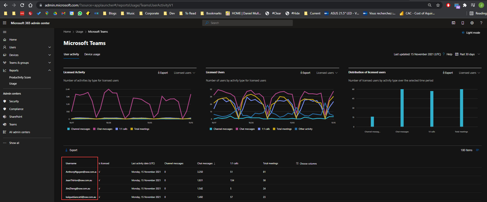

Usage analytics is quite important - it allows you to identify popular and unused teams, and helps figuring out Microsoft Teams adoption across your business (i.e. How many meetings? How many chats? etc...)

There are 2 places to check for usage reports in Teams:

<!--endintro-->

### Team Usage

### Tenant Usage

This is by far the most interesting and import report. You need special (tenant-level) permissions to access those [usage reports](https://admin.microsoft.com/?source=applauncher#/reportsUsage/TeamsUserActivityV1).

Now enjoy the full power of Teams usage analytics!

::: info
**Important:** If you can't see users logins such but GUIDs instead, you will need some SysAdmin magic to make it happen. Simply follow these steps: [Show user details in the reports](https://docs.microsoft.com/en-AU/microsoft-365/admin/activity-reports/activity-reports?view=o365-worldwide#show-user-details-in-the-reports&WT.mc_id=M365-MVP-33518)

...and unlock the power of full O365 reporting!
:::
