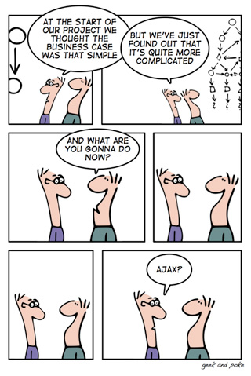

Managing up is providing your manager with an option to approve, rather than asking a general question.

<!--endintro-->

::: greybox
What do you want to charge for Cameron's rate?

:::

::: bad
Figure: Bad Example - Nothing to approve

:::

::: greybox
What do you want to charge for Cameron's rate?

I would advise the standard $165 + GST until he has more experience.
Please approve.

:::

::: good
Figure: Good Example - Option to approve 

:::

When you are giving someone multiple options you should:

* Limit the number of options to 3 to avoid "option overload" (more on           [Choice Overload](https://www.behavioraleconomics.com/resources/mini-encyclopedia-of-be/choice-overload/) and [The Burden of Choice](https://www.psychologytoday.com/au/blog/more-tech-support/201011/the-burden-choice))
* Recommend one and state why

For example:

::: greybox
We want to integrate our database with our website so that customers can purchase online.

The choices:

 **Option A** <mark>(Recommended)</mark> -  Customize a ready-made solution - We are able to get rid of redundant features and change it to meet our requirements. It is cheaper than building a new solution from scratch.  
 **Option B** - Buy a ready-made solution - The ready-made solution is cheap but it does not have everything that we need and has unnecessary features.        
 **Option C** - Build a new solution using a third party company - It will be expensive and it will take a long time.

Please let me know if you're happy to proceed with our recommendation, otherwise let me know if you have any questions.

:::

::: good
Figure: Good Example - Multiple options to approve with reasons for each        

:::

<dl class="image">&lt;dt&gt; 
          
           
      &lt;/dt&gt;<dd> Figure: Hard decision - this guy needs to state why he recommends this option </dd></dl>
### Related Rules         

* [Do you know how to get approval for a purchase?](/_layouts/15/FIXUPREDIRECT.ASPX?WebId=3dfc0e07-e23a-4cbb-aac2-e778b71166a2&TermSetId=07da3ddf-0924-4cd2-a6d4-a4809ae20160&TermId=48889512-6575-4e0e-8a3a-7e6933a41128)
* [Do you always propose all available options?](/_layouts/15/FIXUPREDIRECT.ASPX?WebId=3dfc0e07-e23a-4cbb-aac2-e778b71166a2&TermSetId=07da3ddf-0924-4cd2-a6d4-a4809ae20160&TermId=2b96c878-2c4f-4c5c-8807-304930169da6)
* [Do you have a table summarizing the major features and options?](/_layouts/15/FIXUPREDIRECT.ASPX?WebId=3dfc0e07-e23a-4cbb-aac2-e778b71166a2&TermSetId=07da3ddf-0924-4cd2-a6d4-a4809ae20160&TermId=0eb7e207-f234-44a7-8c48-78ad6d261f74)
