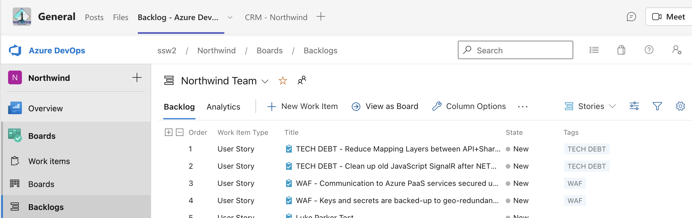
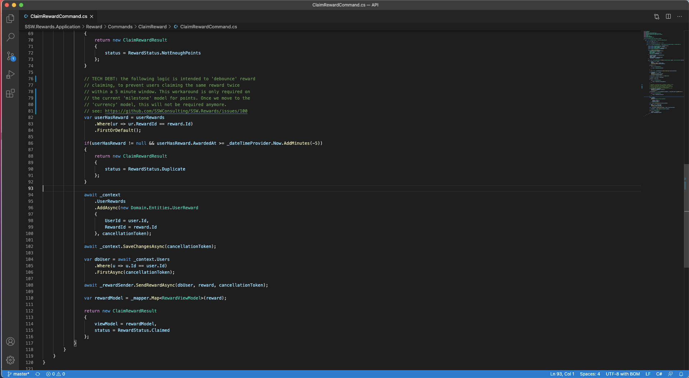
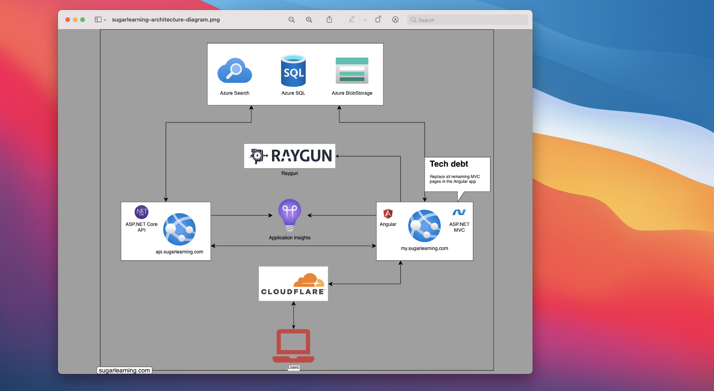

### What is Technical Debt?

Technical Debt is when you defer work that needs doing in your code. And, just like when you defer a payment and accrue financial debt, Technical Debt **must** be repaid, and it accumulates interest (in the form of reduced velocity) while it remains unpaid.

`youtube: https://www.youtube.com/embed/ASVD4YIOgpU`

<!--endintro-->

Technical Debt can occur for all kinds of reasons, for example:

* When you take a shortcut or implement a hack to get a feature out quickly. Sometimes this is because, as a team (including the Product Owner), you've made a conscious decision to take this shortcut because, for example, you need a cut-down version of the feature urgently, or in other cases because of an open bug in a library you depend on.
* Code that is hard to understand after reading it multiple times or a single method that spans multiple screens is also considered to be Technical Debt.

Systems need to have features added to them to continually remain useful (or competitive). As new features are added to the system, often more Technical Debt will be introduced. But as any system ages, it **will** accumulate Technical Debt.

::: greybox
**IMPORTANT:** When you become aware of Technical Debt in a product, you **must** add it to the backlog. Whether you have discovered the Technical Debt or added it intentionally, either way the discussion and decision must be recorded in a PBI. This allows the team to factor paying it back into their Sprint planning.
:::

**Example:** A developer takes a shortcut to get some early feedback on a new feature

* $100 - full feature
* $20 - feature with shortcuts (no tests, dirty code, whatever it takes)
* $80 - IOU via PBI in the backlog e.g. \[FeatureName] – Technical Debt - Planned

::: good

:::

### What are the consequences of Technical Debt?

* Fewer features over time for the customers
* More molasses (developer friction) for the developers

`youtube: https://www.youtube.com/embed/0FlLE8AdZgk`

### The 3 types of Technical Debt

#### 1. Planned Technical Debt

Sometimes you want to quickly implement a new feature to get it out and receive some feedback.

::: greybox
PBI: **\[FeatureName] – Technical Debt - Planned** 
:::

**Note:** Martin Fowler calls this "Deliberate Technical Debt".

#### 2. Discovered Technical Debt

During a code review, you or the team notice something as part of the system that is clearly Technical Debt. This code is hindering the ability to add new features or is hard to read/understand.

::: greybox
PBI: **\[FeatureName] – Technical Debt - Discovered** 
:::

**Note:** Martin Fowler calls this "Inadvertent Technical Debt".

### 3. Unavoidable Technical Debt

Every system will accumulate Technical Debt over time. For example, if you built an API with ASP.NET Core 2.0 (which is now out of support), you have Technical Debt because that version is no longer supported. This kind of Technical Debt cannot only negatively impact the productivity of the team, but it can also introduce a security risk. Another example is that the architecture you selected may have been right based on the original spec, but as requirements change or new requriements emerge, this may no longer be the case. The team can choose to refactor now, or accept the Technical Debt and continue to deliver features on the current architecture.

::: greybox
PBI: **\[FeatureName] - Technical Debt - Unavoidable**
:::

**Note:** Martin Fowler would also classify this as "Inadvertent Technical Debt".

### How to repay Technical Debt

Just like a business that receives pre-payment from customers, a software team should be reviewing the size of their liabilities (being the list of PBIs with Technical Debt).

At the Sprint Planning:

1. Show the Product Owner the list of outstanding Technical Debt PBIs
2. The Product Owner should make sure that the developers review the list of Technical Debt list and pick at least 1 PBI to pay back during the upcoming Sprint

### Screenshots

