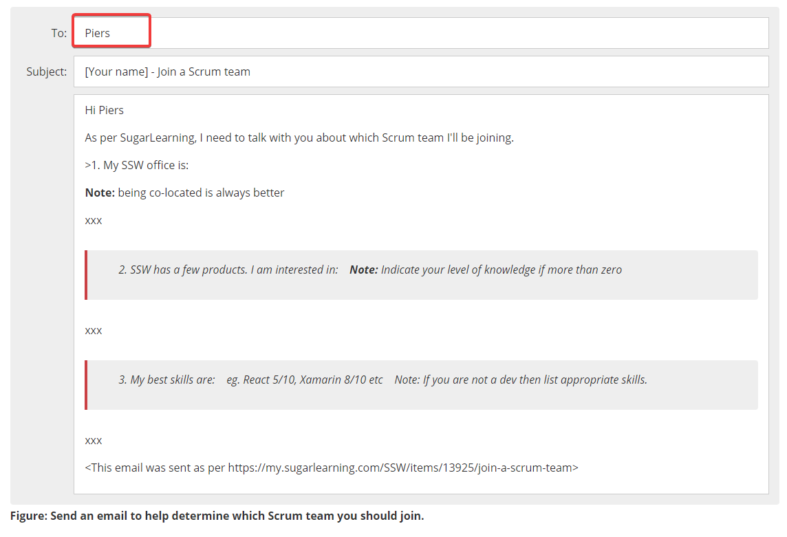

Email templates are an important way to communicate standard emails that should be sent. Usually, these emails need to be sent to a specific person. It is easy to fall into the trap of addressing the templates to that person. This method leads to problems because when that person needs to change, there could be hundreds of locations to change and those locations may not be visible.

So, what are the solutions?

<!--endintro-->

### Use a Role
Instead of an individual, it is better to address the name of a role. For example, if the person is in charge of the product then you might call them "The Product Champion". This title, means that if the responsible person changes then it is a matter of changing who "The Product Champion" is rather than updating that person everywhere in your system.

### Use a Distribution Group
Another problem, is that people may have difficulty finding out who "The Product Champion" is, or they may have to navigate your intranet to find them. So, the gold standard is to setup a distribution group that represents this role.  Using the distribution group, people know what email to send to immediately, and the responsible people can be swapped out easily.

To make sure distribution groups are always up to date it is also important to have a regular script that runs to check for empty distribution groups so they can be updated.

::: bad

:::

::: ok

:::

::: good

:::