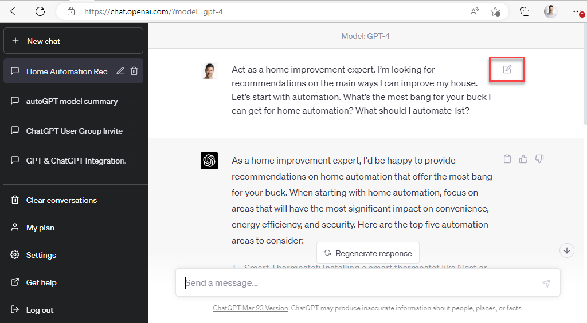
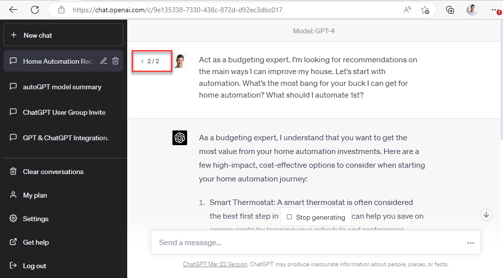

Testing and iterating on your prompts is essential for achieving better results with ChatGPT. By evaluating the responses you receive and refining your prompts accordingly, you can fine-tune your questions and requests to elicit more accurate and useful answers.

<!--endintro-->

Here are some tips for testing and iterating on your prompts:

* Analyze the responses you receive for relevance, accuracy, and completeness
* Identify areas where the response could be improved and adjust your prompt accordingly
* Experiment with different phrasings, keywords, or context to find the most effective prompt
* Don't be afraid to try multiple iterations to achieve the desired outcome

::: greybox
"Tell me about the thing with the apple falling and the guy who discovered something important."
:::
::: bad
Figure: Bad example - You might start with a prompt like this, get sub-optimal output, and then...
:::

::: greybox
"Can you explain the story of Isaac Newton and the falling apple, and how it led to his discovery of the law of universal gravitation?"
:::
::: good
Figure: Good example - The prompt has been iterated to be more specific and clear
:::

By testing and iterating on your prompts, you can improve the quality of ChatGPT's responses and ensure that you receive the information or assistance you're seeking.