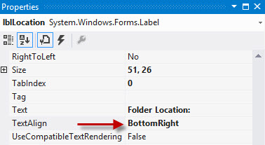
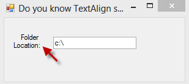
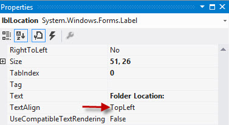
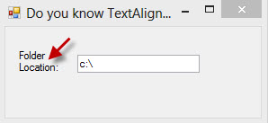

If you add a text box in a form you should add anchoring and/or docking properties to allow it to grow as the form widens, but not as it increases in height.

<!--endintro-->

::: bad

:::

::: bad

:::

::: good

:::

::: good

:::

We have a program called [SSW Code Auditor](http://www.ssw.com.au/ssw/CodeAuditor/) to check for this rule
