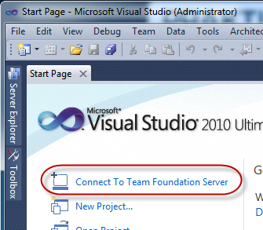
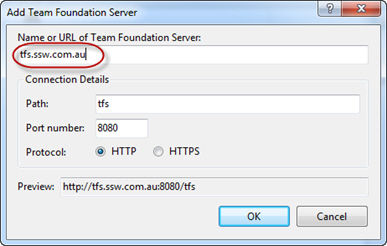
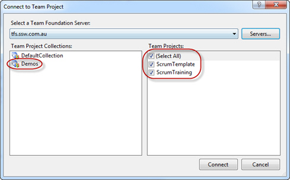
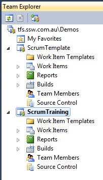
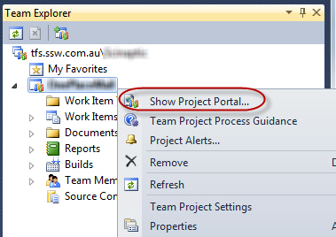
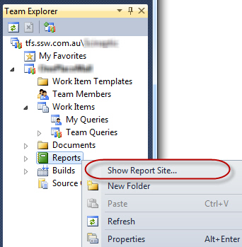
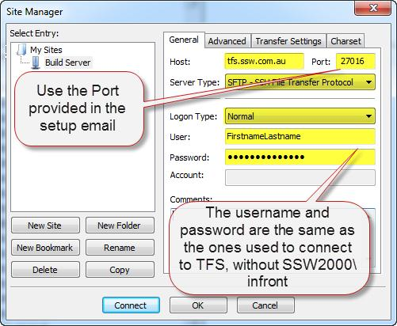

### How to Connect to your TFS Server

1. Connect to your TFS 2010 server you will need either:

   * **Visual Studio 2008 Team System SP1 with the [TFS2010 Forward Compatibility update](http://www.microsoft.com/downloads/en/details.aspx?FamilyID=cf13ea45-d17b-4edc-8e6c-6c5b208ec54d&displaylang=en)** OR
   * **Visual Studio 2010**

<!--endintro-->

2. Connect your Visual Studio to the TFS Server by clicking on Connect To Team Foundation Server

3. Click on Servers | Add
4. Enter the Server Name of tfs.ssw.com.au

5. Click Close
6. In the Connect to Team Project dialog, select your Team Project Collection and tick the Team Projects you want to connect to your Visual Studio

7. You should now see the Team Projects you selected in the Team Explorer

### How to Access a Project's SharePoint Portal

The easiest way to access the SharePoint Portal for a project is to right click the project name in Visual Studio and click Show Project Portal. This will launch a browser window where you will be able to see your SharePoint Portal for the project.

### How to Access a Project's Reports

The easiest way to access the reports for a project is to right click on the Reports menu item under the project and click Show Reports Site. This will launch a browser window where you will be able to see the reports for the project.

### How to Download Builds from your Build Server

When transferring files from the isolated build server, the **SFTP** protocol is used, which is **Secure File Transfer Protocol**, an encrypted file transfer method.

You will need a client that supports SFTP to be able to transfer files. We recommend FileZilla, a free client available for download here: FileZilla Client Download

After you have downloaded and installed FileZilla, follow these steps to connect to the build server and download your builds:

1. Choose **File | Site Manager**
2. Click **New Site**, and enter the name for the new site (eg. Build Server)
3. Enter the following details: 

4. Press the **Connect** button and you will be connected to your Build Server