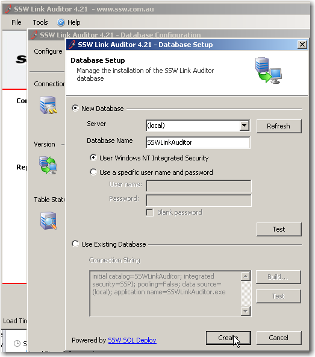

Application upgrade might not only include the .exe and .dll but the database changes. How to deploy these changes, manually or using tools to deploy? 

 Let's see the bad and good examples:   
<!--endintro-->
<dl class="image">    &lt;dt&gt;
    <pre>Dear Mr Northwind, 

Before installing your application, you need to 
run this script by 
first opening up SQL Management Studio. 
Open the attached script, point it to Northwind and 
execute the script. 

Let me know if you have any issues... 
We worked very hard on this release. 

I hope you’re happy with it. 

Regards, 
Eric Phan 
</pre>
    &lt;/dt&gt;
    <dd>Figure: Bad example - run SQL scripts manually </dd></dl><dl class="image">    &lt;dt&gt;
    <pre>Hi Mr. Northwind, 

Please run the attached Northwind_v5.exe. 

Click Run when the prompt appears. 

Regards,
Eric Phan 
</pre>
    &lt;/dt&gt;
    <dd>Figure: Better example - run SQL scripts using another package </dd></dl><dl class="image">    &lt;dt&gt;
    <pre>Dear Mr Northwind, 

When you run the Northwind v1.0 (Rich Client) it will 
automatically upgrade the database for you. 

Just make sure you have dbo permissions: 
Let me know if you run into any issues, 
otherwise have a great day. 

Regards, 
Eric Phan
</pre>
    &lt;/dt&gt;
    <dd>Figure: Best example - run SQL scripts in the application </dd></dl><dl class="image">    &lt;dt&gt; &lt;/dt&gt;
    <dd>Figure: Deploy SQL scripts by the application itself </dd></dl>
 We have a tool called [SQL Deploy](http://www.ssw.com.au/ssw/SQLDeploy) can do this.
