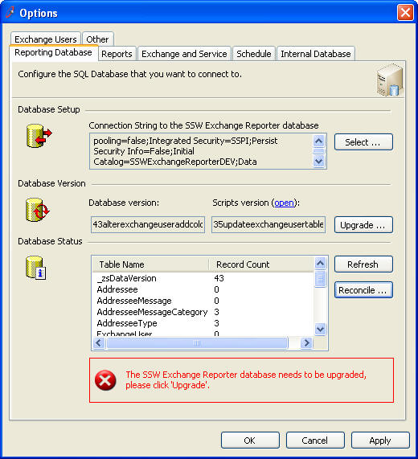
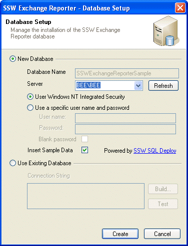

You get an error message reported from a user like:

> *When I click the Save button on the product form it gives an error message about a missing field.*

  

  

You try and reproduce it on your version and everything works perfectly.

You suspect that the customer or someone, probably has changed the schema. So you start drafting an email to the user like:

<!--endintro-->

::: greybox
Mary, I need you to send me your database schema as it might be different from what it should be. Can you:

1. Open up SQL Management Studio
2. Select your server
3. Open enter your credentials
4. Select Databases
5. Open that tree
6. Select the database called Northwind
7. Right click it and choose All Tasks, then  **Generate SQL Script**
8. Then select the options
9. etc
10. Then when I get this I will compare and I will make a script file for you to run and fix the problem

:::

STOP! STOP! STOP!
 It would be much better to just say:

> *Mary, click the "Reconcile" button and it will tell us what is wrong*

Bottom line is the customers' database schema should always be correct, should be managed automatically by the app and if it is not, it is their problem.

Therefore, you should deliver an application with the buttons "Create", Upgrade" and "Reconcile", accessible via "Tools - Options" and a "Database" tab. We do this by using SSW SQL Deploy and throwing on the inherited user-control from the SSW.SQLDeploy.Options project.

For more information see [Best Tools for SQL Server](http://www.ssw.com.au/ssw/Standards/DeveloperGeneral/SQLservertools.aspx#SQLDeploy)
 It looks like this
 Figure: When weird errors are happening at a client, you need a "Reconcile" button in your application. This compares the current scripts, to the client's database and tells you if things are not right  Figure: First time your client opens the application, they will need to Creating a database. It should be as easy as clicking "Create"

::: greybox
As a developer, I promise to do these 3 things:

1. Save every SQL change I do as a script
2. Make sure the application I develop, has 3 buttons, "Create", "Update" and "Reconcile"
3. Never ask a client to run a script

:::

