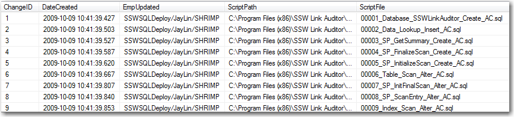

It is best practice to always include an applications version somewhere within  the app, but do you also include the database version, its just as important! 

**(Check with Matt W - Should we change this image to Rules version)**
  

Let's see how to show the Database version:
 
<!--endintro-->

## Modern Applications 

**(Check with Matt W)**

These days we have frameworks such as EF to handle this for us, with its migrations and its ability to track changes. For more auditing purposes, check out [EF Core 6's auditing library](https://entityframework.net/ef-auditing). 

## Legacy Applications:
For legacy applications that aren't using Frameworks such as EF, keeping track of a databases version can be done in the following way. 

Create a new table that will store the version info, this table is called **_zsDataVersion**.
  

For SSW Link Auditor this can be seen in the table status section, with the apps current version being 62. 
  
