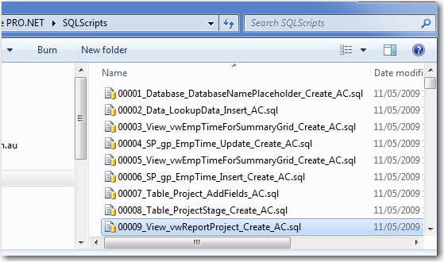

  <dl class="image">
    <dt> </dt>
    <dd>Figure: Everyone shows the version number somewhere on their app </dd>
</dl>
...but databases also need a version number. 
 
Let's see how to show the Database version:  

 <excerpt class='endintro'></excerpt> 

  <dl class="image">
    <dt> </dt>
    <dd>Figure: The applications database should have a table storing the version info (the table is called _zsDataVersion). See an example of this in <a href="http://www.ssw.com.au/SSW/LinkAuditor/">SSW Link Auditor</a> </dd>
</dl>
<dl class="image">
    <dt> </dt>
    <dd>Figure: The user can clearly see the Database version is 62 after clicking "Configure..." button in wizard "Storage Mechanism". See an example of this in <a href="http://www.ssw.com.au/SSW/LinkAuditor/">SSW Link Auditor</a> </dd>
</dl>
<dl class="image">
    <dt> </dt>
    <dd>Figure: The Application keeps all the scripts in a folder called SQLScripts (this allows the application to upgrade itself and give the Reconciliation functionality) </dd>
</dl>

