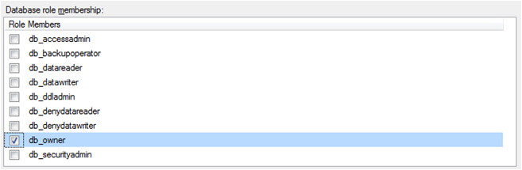

Having many people in a company that are able to make schema changes, can only lead to big problems. This gets worse if the application is powerful (eg. enabled with [SSW SQL Deploy](https://sqldeploy.com/) that can make schema changes itself) can make schema changes.

Let's see how to fix the issue:

<!--endintro-->

To avoid this problem, only one person (the "Schema Master") or the release pipeline should have permissions to upgrade the database.

