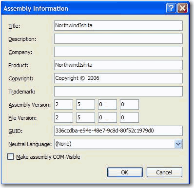

For the purpose of consistency, version numbers should be the same there are few exceptions. One exception is for backward compilation: if you have other .dll files depend on the assembly, changing Assembly Version will break these dependencies and then cause a crash in your application. So you can keep the Assembly Version unchanged and increase the File Version when you release new build. It is easy to maintain the version numbers in VS.NET. For more information on versioning see [semantic versioning](https://www.ssw.com.au/rules/semantic-versioning/). 

<!--endintro-->
