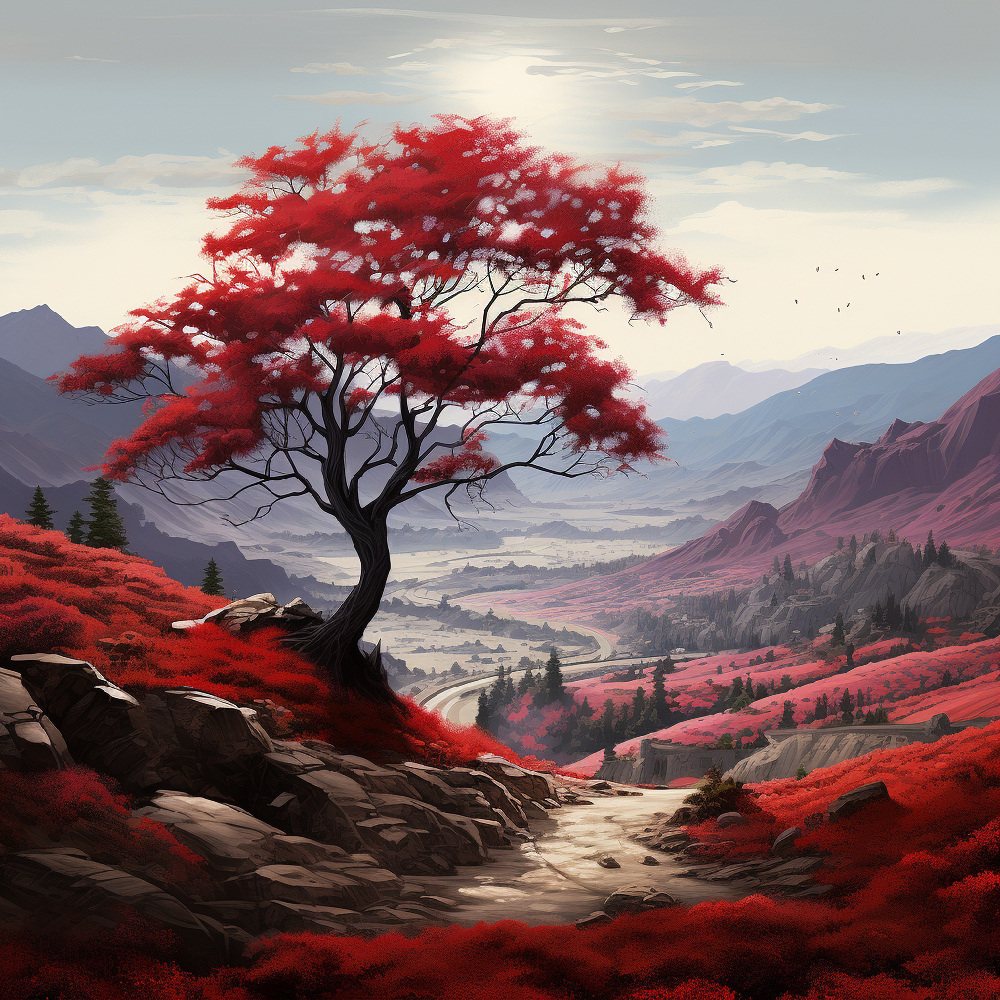
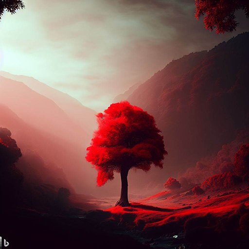
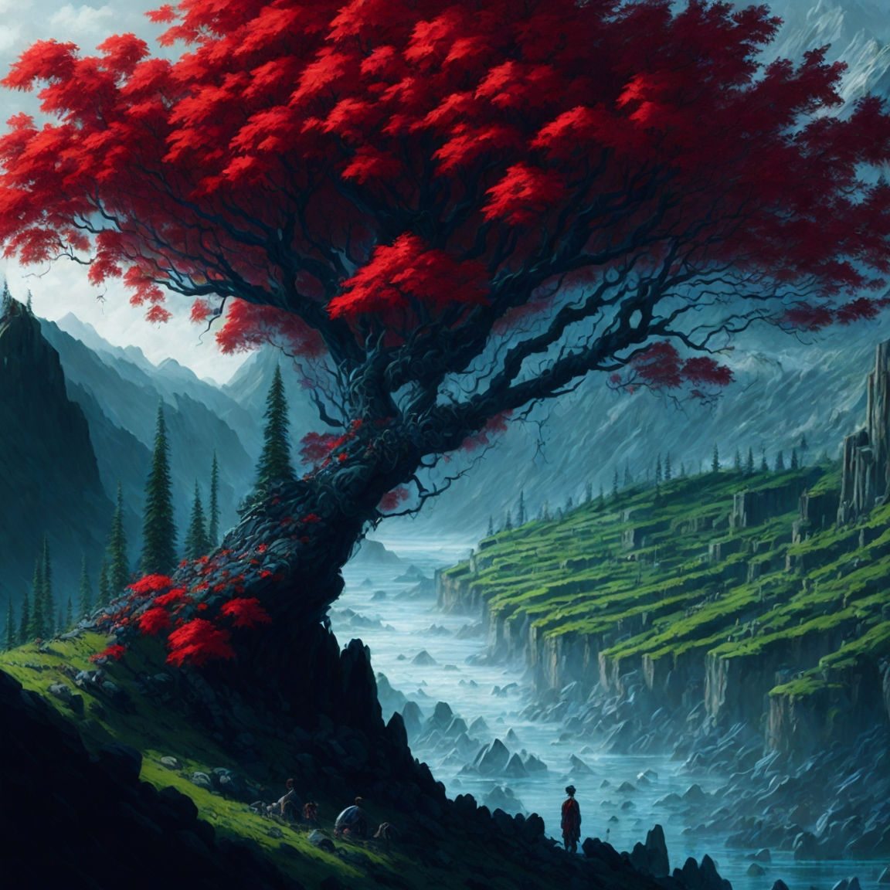
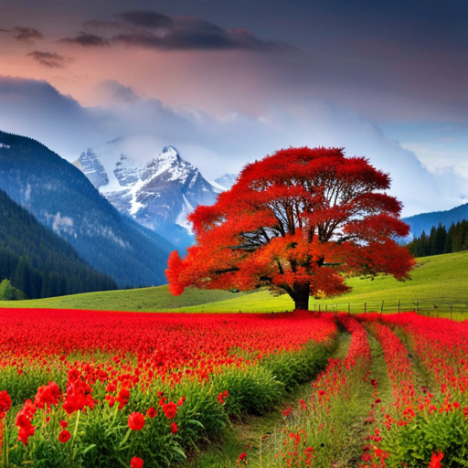

There is general consensus that [Midjourney](https://www.midjourney.com/home/) is the best tool. Behind Midjourney are [DALLE-2](https://openai.com/dall-e-2) and [StableDiffusion](https://beta.dreamstudio.ai/generate). Beware, if you are using any tool besides Midjourney, your images are likely to be noticeably less natural.

<!--endintro-->

## Midjourney

Midjourney is used on Discord, where users interact with the bot by typing /imagine.

**Note:** A [Discord](https://discord.com/) account is required first.

* Cost: $8USD/month

* Images can be reiterated on

* Many parameters: [Midjourney Parameter List](https://docs.midjourney.com/docs/parameter-list) e.g. “--aspect”

* Prompting in Midjourney:

  * Even short prompts can produce beautiful images

  * Basic - /imagine cat

  * Specify an artistic medium – /imagine {{{ ANY ART STYLE }} style cat

  * Get specific – /imagine {{ STYLE }} sketch of a cat

  * Time travel – /imagine {{ DECADE }} cat illustration

  * Emote – /imagine {{ EMOTION }} cat

  * Be colorful – /imagine {{ COLOR WORD }} colored cat

  * Explore environments – /imagine {{ LOCATION }} cat

::: img-medium

:::

## DALL-E 2

DALL-E is an AI system capable of creating realistic images from a natural language description.

* Uses a credit system where users purchase credits to use the model
* Some OpenAI users get free credits each month

::: img-large  

:::

## Leonardo AI

Leonardo AI gets compared to Midjourney for its focus on concept art and imagination. You can use it by creating a free account at [Leonardo.ai](https://leonardo.ai/). Some of Leonardo's unique features are:

* Great website UI
* Incredibly customiseable, with many different models and parameters avaliable
* Built-in image editor
* Built-in prompt generator to help you make the best prompt

::: img-medium

:::

## DreamStudio

DreamStudio is made by StabilityAI and is used, like DALLE2, on a web interface. It is based on the Stable Diffusion model of image generation.

You can use the demo here for free [Stable Diffusion Web](https://stablediffusionweb.com/#demo), or you can use it through the [DreamStudio](https://beta.dreamstudio.ai/dream) interface (starting with a free trial).

* You can use the web demo without signing up
* Easy customization of parameters on the interface (e.g., style, aspect ratio)

::: img-large

:::
